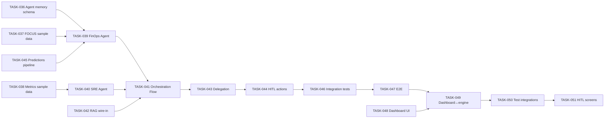

# Cloud FinOps — Project Status & Next Steps

**Last updated:** 2026-08-22
**Maintainer:** Claus Albuquerque

> Living snapshot of where the project stands and what to do next. The canonical,
> detailed work items live in [.ai/TASKS.md](TASKS.md); this file is the fast
> orientation layer. Design references: [agent-design-document.md](../docs/agent-design-document.md),
> [agent-persistance-tools.document.md](../docs/agent-persistance-tools.document.md),
> [agent-retrieval-design.document.md](../docs/agent-retrieval-design.document.md),
> [agent-tree-of-thought.md](../docs/agent-tree-of-thought.md),
> [adr-retrieval-pipeline.md](../ai-agents/docs/adr-retrieval-pipeline.md),
> [adr-agent-runtime.md](../ai-agents/docs/adr-agent-runtime.md).

---

## 1. Where we are

### ✅ Done (foundations + RAG + runtime skeleton)

| Area | Status | Notes |
|------|--------|-------|
| Monorepo + Docker Compose | ✅ | PostgreSQL (pgvector), 3 services, migration runner |
| Database schema — cost (FOCUS) | ✅ | `consumption_records`, `subscriptions`, `resource_groups` |
| Database schema — metrics | ✅ | `tracked_resources`, `metric_definitions`, `metric_data_points`, `utilization_summaries` |
| Database schema — KB / pgvector | ✅ | `kb_documents`, `kb_chunks`, `kb_embeddings`, `kb_ingestion_runs` |
| Database schema — Agent memory | ✅ | `optimization_recommendations`, `anomaly_resolutions`, `infrastructure_baselines`, `agent_interaction_memory` (TASK-036) |
| FOCUS 1.0 sample data loader | ✅ | `finops_ai.loaders.FocusDataLoader`, bundled 1k multi-provider dataset, CLI runner (TASK-037) |
| Synthetic metrics generator | ✅ | `finops_ai.loaders.SyntheticMetricsGenerator`, time-series points + daily summaries (TASK-038) |
| Predictions pipeline | ✅ | `finops_ai.predictions` (SpendForecaster, CostAnomalyDetector, pipeline, CLI runner, tools) (TASK-045) |
| FinOps Specialist Agent | ✅ | `create_finops_agent` (CrewAI Agent, Gemini 2.5 Pro, bounded ReAct, cost/memory tools) (TASK-039) |
| SRE Specialist Agent | ✅ | `create_sre_agent` (CrewAI Agent, Gemini 2.5 Flash, bounded ReAct, infra/baseline tools) (TASK-040) |
| Domain Judge Agents & Reflection Engine | ✅ | `finops_ai.judges` (`FinOpsJudgeEvaluator`, `SREJudgeEvaluator`, `EvaluatorOptimizer`) |
| Orchestration Flow (Policy-Gated Flow) | ✅ | `finops_ai.orchestration.FinOpsFlow` (5 policy gates, memory manager, ReAct coordination) (TASK-041) |
| RAG Agent Integration (Render Step) | ✅ | `RecommendationRenderer` wired to Flow, `retrieve_provider_context` tool, CLI generation (TASK-042) |
| Inter-Agent Delegation Protocol | ✅ | `DelegationController`, Pydantic verdicts, cycle detection, depth bounds (`max_depth=2`) (TASK-043) |
| HITL Write Action Approval Workflow | ✅ | `ApprovalEngine`, SRE safety prerequisite, RBAC threshold, mutation tools (TASK-044) |
| Azure consumption extractor | ✅ | Cost Management API client + storage |
| Azure metrics extractor | ✅ | Monitor client + utilization summaries |
| RAG pipeline (Python) | ✅ | embedding → ingestion → chunking → indexing → retrieval → freshness → observability → ops scheduler (TASK-020→033) |
| Recommendation renderer (RAG) | ✅ | `finops_ai.agents.recommendation_renderer` |
| Python memory DAO | ✅ | `finops_ai.memory` (`AgentMemoryRepository`, contracts, 137 tests green) |
| Agent Engine Integration Suite | ✅ | `tests/test_agent_engine_integration.py` + `scripts/run_integration_suite.py` (TASK-046) |
| E2E Scenario Validation Suite | ✅ | `finops_ai.operations.e2e_scenarios` + `scripts/run_e2e_validation.py` (TASK-047) |
| **Env single-source-of-truth** | ✅ | root `.env` + `scripts/sync-env.sh` → all sub-projects |
| **Git + GitHub** | ✅ | private repo `clausalbuquerque/cloud-finops`, SSH alias `github.com-personal` |
| **Agent runtime ADR** | ✅ | [adr-agent-runtime.md](../ai-agents/docs/adr-agent-runtime.md) — CrewAI + Gemini/Vertex, 2 agents + Flow |
| **CrewAI + Gemini skeleton** | ✅ | `build_llm()` + hello-flow — **live Gemini call passes (`FINOPS_OK`)**, `137 tests` green (TASK-035 closed) |

### 🔄 Immediate Focus & In progress

- **TASK-052 — Multi-Metric Synthetic Telemetry Generation (Memory & CPU) and SRE Utilization Roll-ups** (`TODO` -> ready to start)
- **TASK-053 — Integrate Vectorized Cloud Catalog RAG SKU Lookup into Agent Reasoning Loops** (`TODO` -> ready to start)
- **TASK-048 — Build the dashboard frontend (foundation + core pages)** (`TODO` -> queued next)

### ❌ Not built yet (the work ahead)

dashboard UI + BFF (TASK-048/049) · HITL screens (TASK-051).


---

## 2. Confirmed architecture decisions

1. **Framework:** CrewAI — **Flows** for orchestration (deterministic code), **Agents** for the two specialists. No third/manager LLM.
2. **Agents:** exactly **two** — FinOps + SRE. The "orchestrator" is a **CrewAI Flow**, not an agent.
3. **Reasoning:** bounded ReAct (no Tree-of-Thought); retrieval only at recommendation rendering.
4. **LLM:** Google **Gemini via Vertex AI** (all envs). Dev/test = Express-mode key `GCP_AGENTS_API_KEY`; prod = ADC service account. Local OSS (Ollama) deferred (no local compute).
5. **Delegation:** explicit typed tool (`delegate_to_sre` / `delegate_to_finops`), not `allow_delegation`.
6. **HITL:** CrewAI Flow `@human_feedback` + async provider (no Enterprise license).
7. **Embeddings:** local `nomic-embed-text-v1.5` (unchanged).

### Open decisions (capture as they're resolved)
- Gemini tier per role (FinOps `pro` vs SRE `flash`) — decide in TASK-039/040.
- Predictions stack: Prophet vs statsmodels/Nixtla; Isolation Forest + Z-score — TASK-045.
- Single Agent vs small Crew per specialist (default: single Agent).

---

## 3. Next steps (ordered)

Dependency-driven order from the Phase 2 plan in [.ai/TASKS.md](TASKS.md):



### Immediate (next 1–3 work items)

1. **TASK-036 — Agent long-term-memory schema** *(prerequisite for all agents)*
   - Add TypeORM entities + migration for `optimization_recommendations`,
     `anomaly_resolutions`, `infrastructure_baselines`, `agent_interaction_memory`.
   - Provider-neutral columns; indexes for the primary query paths; export from barrel.
   - Expose a read model (SQLAlchemy/DAO) to the Python runtime.
   - Validate: `migration:run` + `migration:revert`; round-trip one row per table.

2. **TASK-037 — Load FOCUS sample data** *(unblocks FinOps agent testing)*
   - Idempotent loader mapping FOCUS 1.0 CSV → `ConsumptionRecordEntity`
     (dataset: `FinOps-Open-Cost-and-Usage-Spec/FOCUS-Sample-Data`, CC-BY-4.0).
   - Multi-provider (`provider_name`), configurable size, don't commit large gzips.

3. **TASK-038 — Generate synthetic metrics data** *(unblocks SRE agent testing)*
   - `tracked_resources` + `metric_data_points` + `utilization_summaries` with injected
     scenarios (underused/idle/spiky/batch) correlated to FOCUS `resource_id`s; seedable.

### Then (build the engine)

4. **TASK-045 — Predictions pipeline** (forecast + anomaly detection) — backs `forecast_spend` / `get_anomalies`.
5. **TASK-039 — FinOps Agent** (CrewAI Agent + cost tools, bounded ReAct).
6. **TASK-040 — SRE Agent** (CrewAI Agent + infra tools + baselines).
7. **TASK-042 — Wire the existing RAG** into the render step.
8. **TASK-041 — Orchestration Flow** (routing, memory, policy gates).
9. **TASK-043 — Inter-agent delegation** (typed verdicts, loop protection).
10. **TASK-044 — HITL action workflow** (`@human_feedback`, propose→approve→execute).

### Later (quality + product surface)

11. **TASK-046 / TASK-047** — integration + E2E scenario tests.
12. **TASK-048 / TASK-049 / TASK-051** — dashboard UI, engine integration, HITL screens.
13. **TASK-050** — full-stack integration testing.
14. **TASK-034** — runbooks/developer docs for the retrieval pipeline (MEDIUM, independent).

---

## 4. How to run what exists today

```bash
# 0. Environment (single source of truth)
cp .env.example .env            # fill secrets (GCP_AGENTS_API_KEY etc.)
./scripts/sync-env.sh           # distribute to sub-projects

# 1. Database (pgvector)
docker-compose up -d postgres
docker-compose run --rm migration-runner npm run migration:run

# 2. Python AI runtime
cd ai-agents/python
uv pip install --python .venv/bin/python -e .
uv run --python .venv/bin/python python -m unittest discover -s tests -p "test_*.py"

# 3. Validate the CrewAI + Gemini runtime (live call)
uv run --python .venv/bin/python python scripts/run_hello_flow.py
#   -> Flow result: 'FINOPS_OK'  /  Health check: PASS
```

---

## 5. Risks / watch-list

- **Credential hygiene:** `GCP_AGENTS_API_KEY` lives in the (gitignored) root `.env`; rotate if it ever leaks. Move to ADC for prod.
- **`gh` active account:** currently the personal account; run `gh auth switch --user claus-albuquerque-abi` for work repos.
- **Sample-data licensing:** FOCUS sample data is CC-BY-4.0 — keep attribution, don't commit large files.
- **Dependency weight:** CrewAI pulls a large tree into the Python runtime; keep the venv gitignored and pin as needed.
- **Stale knowledge:** freshness controls exist in retrieval; verify high-savings recommendations against live pricing (already designed in TASK-028).
