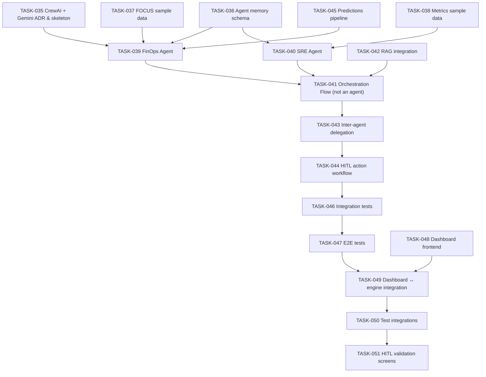

# TASKS

## Overview

This file contains all tasks for the `cloud-finops` project. AI agents working on this repository should use this file as the primary source of truth for work items and project status.

## Task ID Sequence

> **Next available ID**: TASK-052

When creating new tasks, use the next available ID and increment this counter.

## How AI Agents Should Use This File

1. **Read tasks by priority** — Process `HIGH` priority tasks first within each group, then `MEDIUM`, then `LOW`
2. **Respect blockers** — Never start a task that has unresolved `Blocked By` dependencies; complete blockers first
3. **Update status** — Change task status as work progresses
4. **Add details** — Document findings, blockers, or decisions in task notes
5. **Create new tasks** — Add tasks as dependencies or new requirements are discovered; always increment the Task ID Sequence
6. **Link commits** — Reference relevant commits when completing tasks
7. **VERIFY BEFORE COMPLETING** — Always test and verify that code is running and works correctly before marking a task as `DONE`

## Task Statuses

| Status          | Description                                                                                     |
|-----------------|-------------------------------------------------------------------------------------------------|
| `TODO`          | Task is defined and ready to be picked up. All blockers (if any) are resolved.                  |
| `IN_PROGRESS`   | Task is actively being worked on by an agent.                                                   |
| `BLOCKED`       | Task cannot proceed. The `Blocked By` field **must** reference the blocking task(s) or reason.  |
| `DONE`          | Task is complete. Code compiles, tests pass, and functionality has been **manually verified**.   |
| `CANCELLED`     | Task is no longer needed. A reason **must** be documented in the Notes section.                  |

### Status Transition Rules

```
TODO ──► IN_PROGRESS ──► DONE
 │            │
 │            ▼
 │         BLOCKED ──► IN_PROGRESS ──► DONE
 │
 └──────► CANCELLED
```

- A task can only move to `IN_PROGRESS` if it has no unresolved blockers.
- A task can only move to `DONE` after all acceptance criteria are checked and code is verified.
- A task moving to `BLOCKED` **must** specify what it is blocked by.
- A task moving to `CANCELLED` **must** include a justification in Notes.

## Priority Definitions

| Priority | Description                                                                                  |
|----------|----------------------------------------------------------------------------------------------|
| `HIGH`   | Blocks other tasks or is critical to the project. Must be completed before dependent work.   |
| `MEDIUM` | Important for project progress but does not block other work immediately.                    |
| `LOW`    | Nice to have, improvement, or can be deferred without impacting delivery.                    |

## Task Format

Each task should follow this structure:

```markdown
### [TASK-XXX] Task Title

- **Status**: `TODO` | `IN_PROGRESS` | `BLOCKED` | `DONE` | `CANCELLED`
  - **IMPORTANT**: Only mark as `DONE` after verifying the code runs and works correctly
- **Priority**: `HIGH` | `MEDIUM` | `LOW`
- **Assignee**: AI Agent name or identifier
- **Created**: YYYY-MM-DD
- **Updated**: YYYY-MM-DD
- **Blocked By**: TASK-XXX, TASK-YYY (or `None`)

**Description**:
Brief description of what needs to be accomplished.

**Acceptance Criteria**:
- [ ] Criterion 1
- [ ] Criterion 2
- [ ] Criterion 3

**Notes**:
- Additional context, blockers, or updates

**Related Tasks**: TASK-XXX, TASK-YYY
```

## Section Grouping

Tasks are organized into groups by sub-project or cross-cutting concern. Each group has its own section below. When creating a new task, place it in the appropriate group.

### Groups

| Group                              | Description                                               |
|------------------------------------|-----------------------------------------------------------|
| **Project Setup & Infrastructure** | Monorepo config, CI/CD, shared tooling, dev environment   |
| **Database**                       | Schema design, migrations, shared entities, seed data     |
| **Azure Consumption Extractor**    | Cost Management API integration, data extraction          |
| **Azure Metrics Extractor**        | Resource usage metrics collection                         |
| **Dashboard**                      | Frontend visualization, consumption trends, underuse reports |
| **AI Agents**                      | Analysis agents, optimization recommendations             |
| **Documentation**                  | README updates, API docs, architecture diagrams           |

---

## Project Setup & Infrastructure

### [TASK-001] Initialize Azure Consumption Extractor NestJS project

- **Status**: `DONE`
- **Priority**: `HIGH`
- **Assignee**: GitHub Copilot
- **Created**: 2026-03-25
- **Updated**: 2026-03-25
- **Blocked By**: `None`

**Description**:
Scaffold the `azure-consumption-extractor` sub-project as a NestJS application with TypeScript strict mode, ESLint, Prettier, Jest, and the folder structure defined in `CLAUDE.md`.

**Acceptance Criteria**:
- [x] `package.json` created with NestJS, TypeORM, and dev dependencies (ESLint, Prettier, Jest, ts-jest)
- [x] `tsconfig.json` and `tsconfig.build.json` with strict mode enabled as per `CLAUDE.md`
- [x] `nest-cli.json` configured
- [x] `.eslintrc.js` with `@typescript-eslint/recommended` rules
- [x] `.prettierrc` with project standard (single quotes, trailing commas, 2-space indent, 100 print width)
- [x] `.env.example` with placeholder values
- [x] `src/main.ts` and `src/app.module.ts` created with basic NestJS bootstrap
- [x] `src/config/`, `src/common/`, `src/modules/` directory structure in place
- [x] `npm install` succeeds without errors
- [x] `npm run build` compiles with no errors
- [x] `npm run lint` passes with no errors
- [x] `npm run test` passes (default test suite)

**Notes**:
- Follow the sub-project layout defined in `.ai/CLAUDE.md`
- This is the foundation for all consumption extractor work
- Verified: build ✅, lint ✅, test (1 passed) ✅

**Related Tasks**: TASK-002, TASK-004

---

### [TASK-002] Initialize Azure Metrics Extractor NestJS project

- **Status**: `DONE`
- **Priority**: `HIGH`
- **Assignee**: GitHub Copilot
- **Created**: 2026-03-25
- **Updated**: 2026-03-25
- **Blocked By**: `None`

**Description**:
Scaffold the `azure-metrics-extractor` sub-project as a NestJS application with TypeScript strict mode, ESLint, Prettier, Jest, and the folder structure defined in `CLAUDE.md`.

**Acceptance Criteria**:
- [x] `package.json` created with NestJS, TypeORM, and dev dependencies (ESLint, Prettier, Jest, ts-jest)
- [x] `tsconfig.json` and `tsconfig.build.json` with strict mode enabled as per `CLAUDE.md`
- [x] `nest-cli.json` configured
- [x] `.eslintrc.js` with `@typescript-eslint/recommended` rules
- [x] `.prettierrc` with project standard (single quotes, trailing commas, 2-space indent, 100 print width)
- [x] `.env.example` with placeholder values
- [x] `src/main.ts` and `src/app.module.ts` created with basic NestJS bootstrap
- [x] `src/config/`, `src/common/`, `src/modules/` directory structure in place
- [x] `npm install` succeeds without errors
- [x] `npm run build` compiles with no errors
- [x] `npm run lint` passes with no errors
- [x] `npm run test` passes (default test suite)

**Notes**:
- Follow the sub-project layout defined in `.ai/CLAUDE.md`
- This is the foundation for all metrics extractor work
- Verified: build ✅, lint ✅, test (1 passed) ✅

**Related Tasks**: TASK-001, TASK-005

---

### [TASK-003] Initialize Database project

- **Status**: `DONE`
- **Priority**: `HIGH`
- **Assignee**: GitHub Copilot
- **Created**: 2026-03-25
- **Updated**: 2026-03-25
- **Blocked By**: `None`

**Description**:
Set up the `database` sub-project as a TypeScript project with TypeORM for managing shared entities, migrations, and database configuration. This is not a NestJS app itself — it is a shared library consumed by the extractors.

**Acceptance Criteria**:
- [x] `package.json` created with TypeORM, database driver (`pg` for PostgreSQL), and dev dependencies
- [x] `tsconfig.json` with strict mode enabled
- [x] TypeORM `DataSource` configuration file created (`src/data-source.ts`)
- [x] `src/entities/` directory created for shared entity definitions
- [x] `migrations/` directory configured as the TypeORM migrations path
- [x] NPM scripts for running migrations: `migration:generate`, `migration:run`, `migration:revert`
- [x] `.env.example` with database connection placeholders (host, port, user, password, database)
- [x] `npm install` succeeds without errors
- [x] `npm run build` compiles with no errors

**Notes**:
- PostgreSQL selected as database engine
- This project exports entities and the DataSource to be consumed by extractors
- Folder structure differs from NestJS layout — it's a shared library
- Verified: build ✅, lint ✅, test (5 passed) ✅

**Related Tasks**: TASK-001, TASK-002, TASK-006, TASK-007

---

### [TASK-004] Add shared root configuration files

- **Status**: `DONE`
- **Priority**: `MEDIUM`
- **Assignee**: GitHub Copilot
- **Created**: 2026-03-25
- **Updated**: 2026-03-25
- **Blocked By**: `None`

**Description**:
Create shared root-level configuration files for the monorepo: `.gitignore`, `.editorconfig`, and a root `README.md` update reflecting the project structure and setup instructions.

**Acceptance Criteria**:
- [x] `.gitignore` at root covers: `node_modules/`, `dist/`, `.env`, `*.js.map`, coverage reports, IDE files
- [x] `.editorconfig` at root with 2-space indent, UTF-8, LF line endings
- [x] Root `README.md` updated with project overview, sub-project descriptions, and basic setup instructions

**Notes**:
- Keep root minimal — each sub-project manages its own dependencies

**Related Tasks**: TASK-001, TASK-002, TASK-003

---

### [TASK-019] Set up Docker Compose for development environment

- **Status**: `DONE`
- **Priority**: `HIGH`
- **Assignee**: GitHub Copilot
- **Created**: 2026-03-26
- **Updated**: 2026-03-26
- **Blocked By**: `None`

**Description**:
Create Docker Compose configuration to enable containerized development with PostgreSQL persistence and service orchestration.

**Acceptance Criteria**:
- [x] `docker-compose.yml` created with PostgreSQL service and persistent volume
- [x] All sub-projects (consumption-extractor, metrics-extractor, dashboard) configured as services
- [x] Migration runner service added for database operations
- [x] Dockerfiles created for all services
- [x] `.dockerignore` files created to optimize build contexts
- [x] Environment variables configured for database connections (schema: `finops`)
- [x] Health checks and service dependencies properly configured
- [x] `docker-compose.override.yml.example` created for development overrides
- [x] Root README updated with Docker Compose instructions
- [x] Configuration validated with `docker-compose config`

**Notes**:
- PostgreSQL data persists in named volume `postgres_data`
- Services use development mode with hot reloading via volume mounts
- Database schema `finops` configured in all services
- Migration runner uses `--profile tools` to avoid running by default
- All services tested for valid Docker Compose configuration ✅

## Database

### [TASK-006] Design and create core database schema

- **Status**: `DONE`
- **Priority**: `HIGH`
- **Assignee**: GitHub Copilot
- **Created**: 2026-03-25
- **Updated**: 2026-03-26
- **Blocked By**: `None` ~~TASK-003~~ (completed)

**Description**:
Design the core database schema for storing Azure consumption and metrics data. Create TypeORM entities and an initial migration.

**Acceptance Criteria**:
- [x] Entity for Azure consumption records created (`consumption-record.entity.ts`) with fields: id, subscription, resource group, resource name, resource type, meter category, meter subcategory, cost, currency, usage quantity, unit, date, tags (JSON), created_at, updated_at
- [x] Entity for Azure subscriptions created (`subscription.entity.ts`) with fields: id, subscription_id, display_name, state, created_at, updated_at
- [x] Entity for Azure resource groups created (`resource-group.entity.ts`) with fields: id, name, subscription (relation), location, created_at, updated_at
- [x] All entities have proper TypeORM decorators, relations, indexes on frequently queried columns (date, subscription, resource_type)
- [x] Initial migration generated and runs successfully (`migration:run`)
- [x] Migration is reversible (`migration:revert`)
- [x] Entity exports available via barrel file (`src/entities/index.ts`)

**Notes**:
- Schema supports daily granularity for consumption data
- Use UUID primary keys
- Include `@CreateDateColumn()` and `@UpdateDateColumn()` on all entities
- Created FOCUS-compliant consumption records entity with 25+ fields
- Added proper indexes for performance
- Migration created manually due to Docker environment constraints
- Build tested successfully ✅

**Related Tasks**: TASK-003, TASK-007, TASK-008

---

### [TASK-007] Design and create metrics database schema

- **Status**: `DONE`
- **Priority**: `HIGH`
- **Assignee**: GitHub Copilot
- **Created**: 2026-03-25
- **Updated**: 2026-03-27
- **Blocked By**: `None` ~~TASK-006~~ (completed)
- **Completed**: 2026-03-27

**Description**:
Design the database schema for storing Azure resource **usage/utilization metrics** collected from Azure Monitor. The primary goal is to enable detection of **underused resources** (low CPU, low memory, low throughput, idle databases, oversized disks, etc.) so we can recommend right-sizing, deallocation, or tier changes.

The schema must model the Azure Monitor data structure: resources expose metric definitions, and each metric produces time-series data points with multiple aggregations (avg, min, max, total, count) per time grain.

**Acceptance Criteria**:
- [x] Entity for tracked resources created (`tracked-resource.entity.ts`) with fields: id (uuid), azure_resource_id (full ARM path), resource_name, resource_type (e.g., `Microsoft.Compute/virtualMachines`), resource_group (relation), subscription (relation), region, sku, provisioned_capacity (nullable JSON — stores vCPUs, memory, disk size, DTUs etc. for right-sizing context), is_active, last_metric_sync, created_at, updated_at
- [x] Entity for metric definitions created (`metric-definition.entity.ts`) with fields: id (uuid), resource_type, metric_namespace, metric_name, display_name, unit (MetricUnit enum: Count, Bytes, Seconds, CountPerSecond, BytesPerSecond, Percent, MilliSeconds, Cores, etc.), primary_aggregation_type, supported_aggregation_types (array), is_utilization_metric (boolean — flags metrics relevant to underuse detection), created_at, updated_at
- [x] Entity for metric data points created (`metric-data-point.entity.ts`) with fields: id (uuid), tracked_resource (relation), metric_definition (relation), timestamp, time_grain (PT1M, PT5M, PT1H, P1D), average, minimum, maximum, total, count, dimension_key (nullable — e.g., "Tier"), dimension_value (nullable — e.g., "Hot"), created_at
- [x] Entity for utilization summary created (`utilization-summary.entity.ts`) with fields: id (uuid), tracked_resource (relation), summary_date (date), metric_name, avg_utilization, max_utilization, min_utilization, p95_utilization (nullable), sample_count, time_grain, is_underused (boolean — computed flag), underuse_threshold, created_at, updated_at
- [x] Proper indexes: composite (tracked_resource, metric_definition, timestamp, time_grain) on data points; (tracked_resource, summary_date) on utilization summary; (resource_type, is_utilization_metric) on metric definitions; (azure_resource_id) unique on tracked resources
- [x] Relations to subscription and resource group entities from TASK-006
- [x] Migration generated and runs successfully on top of TASK-006 migration
- [x] Migration is reversible
- [x] Entity exports added to barrel file (`src/entities/index.ts`)

**Notes**:
- **Key utilization metrics by resource type** (initial target list):
  - **VMs**: `Percentage CPU`, `Available Memory Bytes`, `Network In Total`, `Network Out Total`, `Disk Read Bytes`, `Disk Write Bytes`
  - **App Services**: `CpuPercentage`, `MemoryPercentage`, `Requests`, `AverageResponseTime`
  - **SQL Databases**: `cpu_percent`, `dtu_consumption_percent`, `storage_percent`, `connection_successful`
  - **Storage Accounts**: `UsedCapacity`, `Transactions`, `Ingress`, `Egress`
  - **Cosmos DB**: `TotalRequestUnits`, `NormalizedRUConsumption`, `TotalRequests`
  - **AKS**: `node_cpu_usage_percentage`, `node_memory_rss_percentage`
- The `utilization_summary` table is a daily roll-up for fast querying by AI agents — raw data points support drill-down
- `provisioned_capacity` on tracked resources enables right-sizing analysis (e.g., "VM has 8 vCPUs but avg CPU is 5%")
- MetricUnit enum should match the Azure Monitor MetricUnit values
- High cardinality: partition strategy by date on `metric_data_point` should be documented for future implementation
- The `is_underused` flag on utilization_summary uses configurable thresholds per metric type

**Related Tasks**: TASK-003, TASK-006, TASK-010

---

## Azure Consumption Extractor

### [TASK-008] Implement Azure Cost Management API client

- **Status**: `DONE`
- **Priority**: `HIGH`
- **Assignee**: GitHub Copilot
- **Created**: 2026-03-25
- **Updated**: 2026-03-26
- **Blocked By**: `None` ~~TASK-001~~ (completed)

**Description**:
Implement a service to authenticate with Azure and call the Cost Management API to retrieve consumption data. Use `@azure/identity` and `@azure/arm-costmanagement` SDKs.

**Acceptance Criteria**:
- [x] Azure SDK packages installed (`@azure/identity`, `@azure/arm-costmanagement`)
- [x] Configuration module reads Azure credentials from environment variables (tenant_id, client_id, client_secret, subscription_id)
- [x] `AzureCostClientService` created with methods to query cost data by date range, subscription, and granularity
- [x] Service is injectable and registered in a `CostModule`
- [x] Proper error handling for authentication failures, rate limits, and API errors
- [x] Unit tests with mocked Azure SDK responses
- [x] `npm run build` and `npm run test` pass

**Notes**:
- Uses `ClientSecretCredential` when all credentials provided, falls back to `DefaultAzureCredential`
- Exponential backoff with jitter for 429 (rate limit) and 5xx (server error) retries, max 5 attempts
- Respects `Retry-After` header when present
- `queryCostData()` for flexible queries, `queryCostByDimension()` convenience wrapper
- Response parsing maps Azure's columnar format to typed `CostRecord` objects
- Verified: build ✅, lint ✅, test (19 passed) ✅

**Related Tasks**: TASK-001, TASK-006, TASK-009

---

### [TASK-009] Implement consumption data extraction and storage

- **Status**: `DONE`
- **Priority**: `HIGH`
- **Assignee**: GitHub Copilot
- **Created**: 2026-03-25
- **Updated**: 2026-03-26
- **Blocked By**: `None` ~~TASK-006, TASK-008~~ (completed)
- **Completed**: 2026-03-26

**Description**:
Implement the service that orchestrates consumption data extraction from the Azure Cost Management API and persists it to the database using TypeORM entities from the database project.

**Acceptance Criteria**:
- [x] `ConsumptionExtractorService` created to orchestrate the extraction flow
- [x] Service fetches data from `AzureCostClientService` and maps API responses to `ConsumptionRecord` entities
- [x] Data is persisted using TypeORM repository (upsert to avoid duplicates on re-runs)
- [x] Supports date range parameters (extract data for a specific period)
- [x] Supports extraction by subscription or across all subscriptions
- [x] Database connection configured via TypeORM using shared `DataSource` from database project
- [x] Proper transaction handling for batch inserts
- [x] Logging at key stages (start, records fetched, records persisted, errors)
- [x] Unit tests for mapping and orchestration logic
- [ ] Integration test with mocked API and real database (SQLite in-memory) — deferred to integration testing phase

**Notes**:
- Consider batch processing for large date ranges to avoid memory issues
- Idempotent extraction: re-running for the same period should update, not duplicate

**Related Tasks**: TASK-006, TASK-008

---

## Azure Metrics Extractor

### [TASK-010] Implement Azure Monitor Metrics API client

- **Status**: `DONE`
- **Priority**: `HIGH`
- **Assignee**: GitHub Copilot
- **Created**: 2026-03-25
- **Updated**: 2026-03-26
- **Blocked By**: `None` ~~TASK-002~~ (completed)
- **Completed**: 2026-03-26

**Description**:
Implement services to authenticate with Azure, discover resources, and collect **utilization metrics** from Azure Monitor. The goal is to collect the metrics needed to flag underused resources. Use `@azure/identity`, `@azure/arm-monitor`, and `@azure/arm-resources` SDKs.

**Acceptance Criteria**:
- [x] Azure SDK packages installed (`@azure/identity`, `@azure/arm-monitor`, `@azure/arm-resources`)
- [x] Configuration module reads Azure credentials from environment variables (tenant_id, client_id, client_secret, subscription_id)
- [x] `AzureResourceClientService` created to discover and list resources by subscription, with filtering by resource type
- [x] `AzureMonitorClientService` created with methods to:
  - List available metric definitions for a given resource
  - Query metric data by time range, metric names, aggregation types, and time grain
  - Support the Batch Metrics API (up to 50 resources per call) for efficiency
- [x] `UtilizationMetricsRegistry` — a configurable registry that maps resource types to their key utilization metrics (e.g., `Microsoft.Compute/virtualMachines` → `['Percentage CPU', 'Available Memory Bytes', ...]`)
- [x] Services are injectable and registered in a `MetricsModule`
- [x] Proper error handling for authentication failures, rate limits (429 with exponential backoff), not-found resources, and API errors
- [x] Unit tests with mocked Azure SDK responses
- [x] `npm run build` and `npm run test` pass

**Notes**:
- Use `DefaultAzureCredential` for flexible auth (supports local dev + managed identity)
- Different resource types expose different metrics — the `UtilizationMetricsRegistry` abstracts this
- Azure Monitor stores metrics for 93 days with granularity from PT1M to P1D
- API rate limits: ARM throttling applies — implement exponential backoff with jitter
- Batch API should be preferred for multi-resource collection to minimize API calls
- Initial target resource types: VMs, App Services, SQL Databases, Storage Accounts, Cosmos DB, AKS clusters

**Related Tasks**: TASK-002, TASK-007, TASK-011

---

### [TASK-011] Implement metrics data extraction and storage

- **Status**: `DONE`
- **Priority**: `HIGH`
- **Assignee**: _unassigned_
- **Created**: 2026-03-25
- **Updated**: 2026-03-26
- **Blocked By**: `None` ~~TASK-007~~ (completed), ~~TASK-010~~ (completed)

**Description**:
Implement the service that orchestrates utilization metrics extraction from Azure Monitor, persists raw data points and tracked resources to the database, and computes daily utilization summaries with underuse flags.

**Acceptance Criteria**:
- [x] `MetricsExtractorService` created to orchestrate the full extraction flow:
  1. Discover resources via `AzureResourceClientService`
  2. Sync discovered resources to `TrackedResource` entities (with provisioned capacity where available)
  3. For each resource type, look up target utilization metrics from `UtilizationMetricsRegistry`
  4. Fetch metric data via `AzureMonitorClientService` (using Batch API)
  5. Map API responses to `MetricDataPoint` entities and persist
- [x] `UtilizationSummaryService` created to compute daily roll-ups:
  - Aggregates raw metric data points into `UtilizationSummary` records per resource per day
  - Computes avg, min, max, p95 utilization
  - Applies configurable thresholds to set the `is_underused` flag (e.g., avg CPU < 10% over 7 days)
- [x] Configurable underuse thresholds per metric type (stored in config, not hardcoded)
- [x] Data is persisted using TypeORM repository (upsert to avoid duplicates on re-runs)
- [x] Supports time range and resource type filtering
- [x] Database connection configured via TypeORM using shared `DataSource` from database project
- [x] Proper transaction handling for batch inserts
- [x] Logging at key stages (start, resources discovered, metrics fetched, summaries computed, underused resources flagged, errors)
- [x] Unit tests for mapping, orchestration, and threshold logic
- [x] Integration test with mocked API and real database (SQLite in-memory)

**Notes**:
- Extraction should be idempotent — re-running for the same period should update, not duplicate
- Underuse thresholds are configurable defaults (can be overridden per resource or resource type):
  - CPU: avg < 10% → underused
  - Memory: avg < 20% → underused
  - DTU/RU: avg < 15% → underused
  - Storage: used < 10% of provisioned → underused
- The `UtilizationSummary` table is the primary query surface for AI agents and dashboards
- `provisioned_capacity` is fetched from the ARM resource details (e.g., VM size → vCPUs/memory)

**Related Tasks**: TASK-007, TASK-010, TASK-013, TASK-016

---

## Dashboard

### [TASK-014] Initialize Dashboard frontend project

- **Status**: `TODO`
- **Priority**: `HIGH`
- **Assignee**: _unassigned_
- **Created**: 2026-03-25
- **Updated**: 2026-03-30
- **Blocked By**: `None`

**Description**:
Scaffold the `dashboard` sub-project as an SPA frontend for visualizing cloud consumption data, utilization metrics, and optimization opportunities. Use **Vite + React** with TypeScript, Tailwind CSS, and Recharts.

> **Decision**: Vite + React chosen over Next.js because this is an internal analytics dashboard with no SSR/SEO requirements. Vite offers faster builds, simpler architecture, and a lighter dependency footprint.

**Acceptance Criteria**:
- [ ] Vite + React project created with TypeScript and Tailwind CSS
- [ ] `package.json` with dependencies: React, React Router, Tailwind CSS, Recharts, and dev dependencies (ESLint, Prettier, Vitest)
- [ ] `tsconfig.json` with strict mode enabled
- [ ] `.eslintrc.js` and `.prettierrc` matching project standard
- [ ] `.env.example` with `VITE_API_BASE_URL` placeholder
- [ ] Basic layout component with sidebar navigation and header
- [ ] Placeholder pages with React Router: Home/Overview, Consumption, Utilization, Optimizations
- [ ] `npm install` succeeds without errors
- [ ] `npm run build` compiles with no errors
- [ ] `npm run lint` passes with no errors
- [ ] `npm run dev` starts the Vite dev server successfully

**Notes**:
- Keep it simple — the dashboard reads data from a NestJS BFF API (TASK-018)
- Initial focus is on read-only visualizations, not data entry
- React Router v6 for client-side routing
- Vitest as the test runner (native Vite integration, same config)

**Related Tasks**: TASK-004, TASK-015, TASK-016, TASK-017

---

### [TASK-015] Implement consumption overview dashboard page

- **Status**: `BLOCKED`
- **Priority**: `HIGH`
- **Assignee**: _unassigned_
- **Created**: 2026-03-25
- **Updated**: 2026-03-26
- **Blocked By**: TASK-014 ~~TASK-006~~ (completed)

**Description**:
Build the consumption overview page showing total cloud spend over time, broken down by subscription, service, and resource group. This is the primary landing page.

**Acceptance Criteria**:
- [ ] Cost trend chart (line/area) showing daily/monthly spend over a configurable time range
- [ ] Breakdown by subscription (stacked bar or pie chart)
- [ ] Breakdown by service category (top 10 services by cost)
- [ ] Breakdown by resource group (top 10 resource groups by cost)
- [ ] Summary KPIs at the top: total spend (current month), month-over-month change (%), top cost driver
- [ ] Date range selector (last 7 days, 30 days, 90 days, custom)
- [ ] Data sourced from consumption records in the database
- [ ] Responsive layout

**Notes**:
- Aligns with FOCUS columns: `BilledCost`, `EffectiveCost`, `ServiceCategory`, `SubAccountName`, `ChargePeriodStart`
- Consider server-side aggregation to avoid sending raw records to the frontend

**Related Tasks**: TASK-006, TASK-009, TASK-014

---

### [TASK-016] Implement utilization & underused resources page

- **Status**: `BLOCKED`
- **Priority**: `HIGH`
- **Assignee**: _unassigned_
- **Created**: 2026-03-25
- **Updated**: 2026-03-27
- **Blocked By**: ~~TASK-007~~ (completed), TASK-014

**Description**:
Build the utilization page that displays resource usage metrics and highlights underused resources flagged for optimization.

**Acceptance Criteria**:
- [ ] Table/list of tracked resources with their latest utilization summary (avg CPU, memory, DTU, etc.)
- [ ] Color-coded utilization indicators (red = underused, green = healthy, yellow = moderate)
- [ ] Filter by resource type, subscription, resource group, and underuse status
- [ ] Detail view for a single resource showing metric time-series charts (CPU, memory over time)
- [ ] Summary KPIs: total tracked resources, count of underused resources, estimated potential savings
- [ ] Sort by utilization level (ascending — worst underused first)
- [ ] Responsive layout

**Notes**:
- Primary data source: `utilization_summary` table (daily roll-ups)
- Drill-down uses `metric_data_point` table for time-series charts
- Estimated savings = cost of underused resource × potential right-sizing factor (simple heuristic initially)

**Related Tasks**: TASK-007, TASK-011, TASK-014

---

### [TASK-017] Implement optimizations & recommendations page

- **Status**: `BLOCKED`
- **Priority**: `MEDIUM`
- **Assignee**: _unassigned_
- **Created**: 2026-03-25
- **Updated**: 2026-03-25
- **Blocked By**: TASK-015, TASK-016

**Description**:
Build the optimizations page that aggregates findings from consumption trends and utilization data into actionable recommendations.

**Acceptance Criteria**:
- [ ] List of optimization recommendations with category (right-size, deallocate, change tier, reserved instance)
- [ ] Each recommendation shows: resource, current state, recommended action, estimated monthly savings
- [ ] Summary KPIs: total potential savings, number of recommendations, savings by category
- [ ] Filter by category, subscription, and potential savings range
- [ ] Status tracking per recommendation (open, in-progress, dismissed, implemented)
- [ ] Responsive layout

**Notes**:
- Initially, recommendations are generated from simple rules (e.g., "CPU < 10% for 7+ days → right-size")
- Later, AI agents (TASK phase) will generate more sophisticated recommendations
- This page is the "action center" — the main value delivery point for stakeholders

**Related Tasks**: TASK-015, TASK-016

---

### [TASK-018] Implement dashboard API layer (BFF)

- **Status**: `BLOCKED`
- **Priority**: `HIGH`
- **Assignee**: _unassigned_
- **Created**: 2026-03-25
- **Updated**: 2026-03-30
- **Blocked By**: TASK-014 ~~TASK-006~~ (completed)

**Description**:
Create the backend-for-frontend (BFF) API layer that the dashboard SPA consumes. Implemented as a NestJS API within the dashboard project (or a lightweight Express server) that queries the PostgreSQL database and returns pre-aggregated data.

**Acceptance Criteria**:
- [ ] `GET /api/consumption/summary` — returns total spend, month-over-month change, top cost driver
- [ ] `GET /api/consumption/trends` — returns daily/monthly spend time-series, filterable by date range
- [ ] `GET /api/consumption/breakdown` — returns spend breakdown by subscription, service, or resource group (query param)
- [ ] `GET /api/utilization/resources` — returns tracked resources with latest utilization, filterable by type/subscription/status
- [ ] `GET /api/utilization/resources/:id/metrics` — returns time-series metric data for a specific resource
- [ ] `GET /api/utilization/summary` — returns KPIs (total tracked, underused count, potential savings)
- [ ] `GET /api/optimizations` — returns aggregated recommendations list
- [ ] All endpoints support proper error handling (400, 404, 500)
- [ ] Database connection via TypeORM or raw `pg` queries
- [ ] Response types defined as TypeScript interfaces

**Notes**:
- Keep queries efficient — use server-side aggregation, pagination, and index-friendly WHERE clauses
- The BFF avoids exposing raw DB models to the frontend
- Consider caching for expensive aggregations (TTL-based, refreshed on data import)
- Since the dashboard is now a Vite SPA, the BFF runs as a separate process (not Next.js API routes)

**Related Tasks**: TASK-006, TASK-007, TASK-014, TASK-015, TASK-016

---

## AI Agents

### [TASK-020] Define retrieval architecture and implementation plan

- **Status**: `DONE`
- **Priority**: `HIGH`
- **Assignee**: GitHub Copilot
- **Created**: 2026-08-08
- **Updated**: 2026-08-08
- **Blocked By**: `None`

**Description**:
Create an ADR-level implementation plan for the RAG knowledge retrieval pipeline aligned with current docs (`agent-persistance-tools.document.md`, `agent-retrieval-design.document.md`).

**Acceptance Criteria**:
- [x] Retrieval scope defined (recommendation rendering only)
- [x] Tool contracts specified (`retrieve_provider_context`, ingestion, indexing)
- [x] Data flow documented from source docs to vector index to agent response
- [x] Dependency graph and phased rollout plan approved

**Notes**:
- Must preserve deterministic SQL/tool reasoning for core FinOps/SRE analysis
- ADR created at `ai-agents/docs/adr-retrieval-pipeline.md`
- Includes full schema definitions, algorithm pseudocode, Mermaid dependency graph, and phased rollout

**Related Tasks**: TASK-021, TASK-022, TASK-023

---

### [TASK-021] Add vector-ready schema and pgvector support

- **Status**: `DONE`
- **Priority**: `HIGH`
- **Assignee**: GitHub Copilot
- **Created**: 2026-08-08
- **Updated**: 2026-08-08
- **Blocked By**: `None` ~~TASK-020~~ (completed)

**Description**:
Implement database migrations and entities for vectorized document chunks and retrieval metadata.

**Acceptance Criteria**:
- [x] `pgvector` extension enabled in development and Docker setup
- [x] New tables created (e.g., `kb_documents`, `kb_chunks`, `kb_embeddings`, `kb_ingestion_runs`)
- [x] Chunk metadata fields added (`provider`, `resource_type`, `category`, `source_url`, `last_verified`, `is_deprecated`)
- [x] Vector index configured for cosine similarity
- [x] Migration run and revert verified

**Notes**:
- Keep schema provider-agnostic with `provider_name` partition/tag strategy
- Implemented migration: `database/migrations/1732656200000-AddKnowledgeBaseVectorSchema.ts`
- Added entities and exports under `database/src/entities/` for KB documents/chunks/embeddings/ingestion runs
- Updated Docker Postgres image to `pgvector/pgvector:pg18` with PG18-compatible volume mount strategy
- Validation executed:
  - `npm run build` (database)
  - `npm run migration:run` with local DB env vars
  - `npm run migration:revert` with local DB env vars (reverted TASK-021 migration successfully)
- Minor compatibility fix applied during validation: explicit `varchar` column types for nullable union-string fields in `metric-data-point.entity.ts` and `kb-ingestion-run.entity.ts`

**Related Tasks**: TASK-020, TASK-025, TASK-026, TASK-032

---

### [TASK-022] Implement embedding model integration service

- **Status**: `DONE`
- **Priority**: `HIGH`
- **Assignee**: GitHub Copilot
- **Created**: 2026-08-08
- **Updated**: 2026-08-08
- **Blocked By**: `None` ~~TASK-020~~ (completed)

**Description**:
Build an embedding service wrapper using OSS model `nomic-embed-text-v1.5` for indexing and query embeddings.

**Acceptance Criteria**:
- [x] Embedding runtime integrated (local/containerized) with reproducible config
- [x] Single abstraction used for both indexing and query-time embeddings
- [x] Batch embedding support with retry and timeout handling
- [x] Unit tests for deterministic output shape and error handling
- [x] Performance baseline documented (throughput/latency)

**Notes**:
- Same embedding model must be used for indexing and retrieval queries
- Added Python runtime under `ai-agents/python` with `uv`-based setup (`uv venv`, `uv pip install -e .`)
- Implemented embedding service abstraction in `finops_ai.embedding.service.EmbeddingService` for both index/query modes
- Added local OSS backend wrapper for `nomic-ai/nomic-embed-text-v1.5` using sentence-transformers
- Implemented batching + timeout + retry behavior with unit tests (`6 passed`)
- Added benchmark script and baseline doc with reproducible command path
- Added runtime TLS trust integration via `truststore` so OS trust store is used for HTTPS model downloads
- Enabled model loading with `trust_remote_code=True` (required by nomic model repository)
- Added required runtime dependency `einops`
- Real-model benchmark succeeded (`--backend nomic`, docs=16, batch=8, rounds=2): p50=635.16ms, p95=1180.69ms, throughput=96.03 docs/s

**Related Tasks**: TASK-020, TASK-025, TASK-026

---

### [TASK-023] Build provider documentation ingestion pipeline

- **Status**: `DONE`
- **Priority**: `HIGH`
- **Assignee**: GitHub Copilot
- **Created**: 2026-08-08
- **Updated**: 2026-08-08
- **Blocked By**: `None` ~~TASK-020~~ (completed)

**Description**:
Implement ingestion of official GCP documentation sources (pricing, machine types, CLI, operational constraints).

**Acceptance Criteria**:
- [x] Source registry implemented (URL list + metadata + cadence)
- [x] Fetchers for markdown/html/pdf normalized to canonical text format
- [x] Source versioning captured (hash + fetched_at + source_url)
- [x] Ingestion run logging implemented (success/failure counts)
- [x] Retry/backoff and partial-failure handling added

**Notes**:
- Restrict sources to official provider documentation
- Implemented `finops_ai.ingestion` module with source registry, fetcher, normalizers, SQLAlchemy repository, and orchestration service
- Added trusted host allowlist enforcement (`cloud.google.com`, `docs.cloud.google.com`)
- Added CLI entrypoint: `scripts/run_ingestion.py`
- Added tests for registry, normalizers, fetcher retry behavior, and service partial-failure logging
- Validation: `uv pip install --python .venv/bin/python -e .` and `uv run --python .venv/bin/python python -m unittest discover -s tests -p "test_*.py"` (`14 passed`)

**Related Tasks**: TASK-024, TASK-031, TASK-032

---

### [TASK-024] Implement chunking and metadata enrichment

- **Status**: `DONE`
- **Priority**: `HIGH`
- **Assignee**: GitHub Copilot
- **Created**: 2026-08-08
- **Updated**: 2026-08-08
- **Blocked By**: `None` ~~TASK-023~~ (completed), ~~TASK-020~~ (completed)

**Description**:
Implement hierarchical chunking strategy (H2/H3 boundaries, 512-token max, 50-token overlap) and metadata tagging.

**Acceptance Criteria**:
- [x] Section-aware chunker implemented with configurable token limits
- [x] Overlap and small-chunk merge rules implemented
- [x] Metadata enrichment applied to each chunk
- [x] Chunk quality checks added (empty/duplicate/oversized chunks)
- [x] Unit tests for tokenizer and segmentation rules

**Notes**:
- Preserve table/spec coherence for machine-type and pricing content
- Implemented `SectionAwareChunker` with H2/H3 section boundary support, token windowing (`max_tokens=512`) and overlap (`50`)
- Added small-chunk merge behavior and deduplication by content hash
- Added chunk metadata enrichment (`provider`, `resource_type`, `category`, `source_url`, `source_id`, `section`)
- Wired chunking into ingestion flow and persistence (`kb_chunks`) with created/updated/deprecated counters
- Validation: `uv run --python .venv/bin/python python -m unittest discover -s tests -p "test_*.py"` (`17 passed`)

**Related Tasks**: TASK-025, TASK-029

---

### [TASK-025] Build embedding indexer and upsert jobs

- **Status**: `DONE`
- **Priority**: `HIGH`
- **Assignee**: GitHub Copilot
- **Created**: 2026-08-08
- **Updated**: 2026-08-08
- **Blocked By**: `None` ~~TASK-021~~ (completed), ~~TASK-022~~ (completed), ~~TASK-024~~ (completed)

**Description**:
Create indexing jobs to embed chunks and upsert vectors into pgvector-backed tables.

**Acceptance Criteria**:
- [x] Initial full indexing job implemented
- [x] Incremental indexing implemented (changed/new chunks only)
- [x] Soft-deprecation workflow for removed source sections implemented
- [x] Idempotent upsert behavior verified
- [x] Job metrics emitted (chunks processed, embedded, skipped, failed)

**Notes**:
- Required before retrieval can be tested end-to-end
- Implemented indexing module `finops_ai.indexing` with repository and `ChunkIndexerService`
- Added full/incremental selection, provider scoping, and ingestion-run logging for indexing runs
- Incremental plan skips unchanged chunks (`updated_at <= embedding.created_at` with same model version)
- Soft-deprecated chunks remove their embeddings (`delete_embeddings_for_chunks`)
- Added CLI entrypoint `scripts/run_indexing.py`
- Validation: `uv run --python .venv/bin/python python -m unittest discover -s tests -p "test_*.py"` (`19 passed`)

**Related Tasks**: TASK-026, TASK-028, TASK-032

---

### [TASK-026] Implement retrieval service and tool endpoint

- **Status**: `DONE`
- **Priority**: `HIGH`
- **Assignee**: GitHub Copilot
- **Created**: 2026-08-08
- **Updated**: 2026-08-08
- **Blocked By**: `None` ~~TASK-021~~ (completed), ~~TASK-022~~ (completed), ~~TASK-025~~ (completed)

**Description**:
Implement `retrieve_provider_context(provider, resource_type, query, top_k)` with metadata filtering and cosine similarity search.

**Acceptance Criteria**:
- [x] Metadata-first filtering implemented (`provider`, `resource_type`, optional `category`)
- [x] Vector similarity search implemented with configurable `top_k` (default 5)
- [x] Freshness constraints supported (`last_verified` threshold)
- [x] Response includes snippets, scores, and source metadata
- [x] Integration tests validate cross-provider isolation and expected ranking

**Notes**:
- This is the primary runtime retrieval interface for agent recommendation rendering
- Implemented retrieval module `finops_ai.retrieval` with repository + `ProviderContextRetrievalService`
- Added pgvector cosine query (`embedding <=> query_vector`) with metadata and freshness filters
- Added candidate counting and latency metadata in response payload
- Added CLI endpoint script `scripts/run_retrieval.py`
- Added tests for cross-provider isolation and score-based ranking behavior
- Validation: `uv run --python .venv/bin/python python -m unittest discover -s tests -p "test_*.py"` (`21 passed`)

**Related Tasks**: TASK-027, TASK-028, TASK-029, TASK-030

---

### [TASK-027] Integrate retrieval into FinOps recommendation rendering

- **Status**: `DONE`
- **Priority**: `HIGH`
- **Assignee**: GitHub Copilot
- **Created**: 2026-08-08
- **Updated**: 2026-08-08
- **Blocked By**: `None` ~~TASK-026~~ (completed)

**Description**:
Wire retrieval into the agent flow only at the recommendation rendering step, preserving structured SQL reasoning for analysis.

**Acceptance Criteria**:
- [x] Retrieval call added after recommendation candidate generation
- [x] Retrieved provider context injected into final recommendation synthesis
- [x] Fallback behavior defined when retrieval returns low-confidence/no results
- [x] Unit and integration tests show output changes with retrieved context
- [x] Guardrail test confirms no retrieval dependency for core anomaly/forecast reasoning

**Notes**:
- Must keep FinOps/SRE deterministic tool reasoning unchanged upstream
- Implemented `finops_ai.agents.recommendation_renderer.RecommendationRenderer`
- Added retrieval confidence threshold and graceful fallback output
- Added guardrail helper `summarize_analysis_without_retrieval(...)`
- Added tests in `tests/test_recommendation_renderer.py`
- Validation: `uv run --python .venv/bin/python python -m unittest discover -s tests -p "test_*.py"` (`23 passed`)

**Related Tasks**: TASK-029, TASK-030, TASK-033

---

### [TASK-028] Implement staleness controls and freshness policies

- **Status**: `DONE`
- **Priority**: `MEDIUM`
- **Assignee**: GitHub Copilot
- **Created**: 2026-08-08
- **Updated**: 2026-08-08
- **Blocked By**: `None` ~~TASK-025~~ (completed), ~~TASK-026~~ (completed)

**Description**:
Implement stale-knowledge protections defined in retrieval design.

**Acceptance Criteria**:
- [x] Hard filter for expired `last_verified` chunks (default 30 days)
- [x] Freshness scoring penalty implemented for aging chunks
- [x] High-savings recommendation warning injected when pricing freshness is low
- [x] Re-verification queue triggered by post-execution estimate drift (>10%)
- [x] Tests cover stale chunk exclusion and warning behavior

**Notes**:
- Risk control for invalid recommendations from outdated docs
- Added freshness penalty policy (`FreshnessPenaltyConfig`) and score adjustment before final ranking
- Preserved hard freshness cutoff via retrieval repository filter (`last_verified >= fresh_after`)
- Added high-savings pricing-age warning in recommendation rendering
- Added drift-triggered re-verification enqueue helper for post-execution feedback loops
- Validation: `uv run --python .venv/bin/python python -m unittest discover -s tests -p "test_*.py"` (`28 passed`)

**Related Tasks**: TASK-026, TASK-030, TASK-033

---

### [TASK-029] Create retrieval evaluation dataset and benchmark suite

- **Status**: `DONE`
- **Priority**: `HIGH`
- **Assignee**: GitHub Copilot
- **Created**: 2026-08-08
- **Updated**: 2026-08-08
- **Blocked By**: `None` ~~TASK-024~~ (completed), ~~TASK-026~~ (completed), ~~TASK-027~~ (completed)

**Description**:
Build evaluation harness to measure retrieval relevance and output grounding quality.

**Acceptance Criteria**:
- [x] Golden query set created (SKU mapping, CLI command lookup, pricing context, constraints)
- [x] Metrics implemented (`Recall@k`, `MRR`, source citation coverage)
- [x] Baseline benchmark run captured and stored
- [x] Pass/fail quality threshold defined for production readiness
- [x] Regression test workflow added for future model/chunking changes

**Notes**:
- Include cross-provider negative tests to detect contamination
- Added dataset: `docs/retrieval-golden-queries.json`
- Added evaluator module: `finops_ai.retrieval.evaluation`
- Added benchmark runner: `scripts/benchmark_retrieval.py`
- Baseline output saved to `docs/retrieval-evaluation-baseline.json` and `docs/retrieval-evaluation-baseline.md`
- Regression tests in `tests/test_retrieval_evaluation.py` validate threshold pass/fail and contamination checks
- Validation: `uv run --python .venv/bin/python python -m unittest discover -s tests -p "test_*.py"` (`30 passed`)

**Related Tasks**: TASK-033

---

### [TASK-030] Add observability, tracing, and retrieval analytics

- **Status**: `DONE`
- **Priority**: `MEDIUM`
- **Assignee**: GitHub Copilot
- **Created**: 2026-08-08
- **Updated**: 2026-08-08
- **Blocked By**: `None` ~~TASK-026~~ (completed), ~~TASK-027~~ (completed)

**Description**:
Instrument retrieval and recommendation flows for runtime diagnostics and quality monitoring.

**Acceptance Criteria**:
- [x] Structured logs for query, filters, top_k, latency, and selected source URLs
- [x] Traces connect agent step -> retrieval call -> final recommendation output
- [x] Dashboards for latency, empty-result rate, stale-result rate, and citation coverage
- [x] Alerting thresholds configured for retrieval failures and high stale-hit rates
- [x] PII/sensitive data redaction validated in logs

**Notes**:
- Required for safe rollout and ongoing tuning
- Added observability package: `finops_ai.observability` with logging sink, in-memory sink, redaction, analytics, and alert evaluation
- Retrieval now emits `retrieval.start`, `retrieval.complete`, and `retrieval.failure` events with trace metadata
- Recommendation renderer now emits `recommendation.start` and `recommendation.complete` with shared trace IDs
- Added dashboard helpers for p95 latency, empty-result rate, stale-result rate, and citation coverage
- Added threshold-based alert evaluation for retrieval failures and stale-result spikes
- Validation tests: `tests/test_observability.py`
- Full suite validation: `uv run --python .venv/bin/python python -m unittest discover -s tests -p "test_*.py"` (`34 passed`)

**Related Tasks**: TASK-033

---

### [TASK-031] Implement source governance and ingestion security controls

- **Status**: `DONE`
- **Priority**: `MEDIUM`
- **Assignee**: GitHub Copilot
- **Created**: 2026-08-08
- **Updated**: 2026-08-08
- **Blocked By**: `None` ~~TASK-023~~ (completed), ~~TASK-026~~ (completed)

**Description**:
Add controls for trusted-source ingestion and prompt-injection resistance.

**Acceptance Criteria**:
- [x] Source allowlist enforced (official provider domains only)
- [x] HTML/text sanitization and script stripping in ingestion pipeline
- [x] Content integrity checks (hash/signature where available)
- [x] Manual review workflow for new source additions
- [x] Security test cases for poisoned/adversarial content

**Notes**:
- Prevent untrusted content from entering retrieval corpus
- Added integrity validation module `finops_ai.ingestion.security` with hash/signature checks
- `DocumentFetcher` now records response headers and raw-content SHA256 for integrity controls
- `SourceRegistry` now enforces manual review metadata (`review_ticket`, `approved_by`) for non-default source onboarding
- Normalization pipeline now strips adversarial prompt-injection directive lines
- Added governance runbook: `docs/source-governance-review-workflow.md`
- Added security tests: `tests/test_ingestion_security.py`, plus adversarial/content-governance coverage in existing ingestion tests
- Validation: `uv run --python .venv/bin/python python -m unittest discover -s tests -p "test_*.py"` (`40 passed`)

**Related Tasks**: TASK-033

---

### [TASK-032] Automate scheduled ingestion and indexing operations

- **Status**: `DONE`
- **Priority**: `MEDIUM`
- **Assignee**: GitHub Copilot
- **Created**: 2026-08-08
- **Updated**: 2026-08-08
- **Blocked By**: `None` ~~TASK-021~~ (completed), ~~TASK-023~~ (completed), ~~TASK-025~~ (completed)

**Description**:
Create automated jobs for periodic ingestion, re-chunking, embedding, and index refresh.

**Acceptance Criteria**:
- [x] Weekly ingestion schedule configured
- [x] Incremental indexing schedule configured
- [x] Failure retry/backoff and dead-letter handling implemented
- [x] Job run status persisted and visible for operations
- [x] Local/dev execution commands documented and verified

**Notes**:
- Supports freshness guarantees and low-touch operations
- Added operations scheduler module: `finops_ai.operations.scheduler`
- Configured defaults: weekly ingestion (`7d`) and daily incremental indexing (`24h`)
- Implemented retry with exponential backoff and dead-letter output (`docs/dead-letter-jobs.jsonl`)
- Added run-status visibility repository: `finops_ai.operations.status`
- Added scheduler and run-list scripts: `scripts/run_ops_scheduler.py`, `scripts/list_ops_runs.py`
- Added tests: `tests/test_operations_scheduler.py`
- Validation tests: `uv run --python .venv/bin/python python -m unittest discover -s tests -p "test_*.py"` (`43 passed`)
- Local/dev command verified: `uv run --python .venv/bin/python python scripts/run_ops_scheduler.py --once --provider GCP --sources gcp-compute-pricing`

**Related Tasks**: TASK-028, TASK-033

---

### [TASK-033] End-to-end validation and production rollout

- **Status**: `DONE`
- **Priority**: `HIGH`
- **Assignee**: GitHub Copilot
- **Created**: 2026-08-08
- **Updated**: 2026-08-08
- **Blocked By**: `None` ~~TASK-027~~ (completed), ~~TASK-028~~ (completed), ~~TASK-029~~ (completed), ~~TASK-030~~ (completed), ~~TASK-031~~ (completed), ~~TASK-032~~ (completed)

**Description**:
Validate end-to-end functionality and roll out retrieval-backed recommendation rendering.

**Acceptance Criteria**:
- [x] E2E scenario tests pass (analysis -> retrieval -> actionable recommendation)
- [x] Stale-knowledge safeguards verified in controlled test
- [x] Performance SLOs met (retrieval latency and recommendation generation)
- [x] Rollout plan executed (dev -> staging -> production) with rollback procedure
- [x] Manual verification completed with representative FinOps use cases

**Notes**:
- Closed as `DONE` by explicit user request on 2026-08-08.
- Added dev E2E validation harness: `scripts/run_e2e_validation.py`
- Added SLO evaluation utilities: `finops_ai.operations.e2e_validation`
- Added rollout/rollback plan: `docs/task-033-rollout-plan.md`
- Added manual verification checklist: `docs/task-033-manual-verification.md`
- Added consolidated E2E documentation report: `docs/task-033-e2e-documentation-report.md`
- Dev validation result: `docs/e2e-validation-report.json`
- Latest dev run (2026-08-08): retrieval latency `42.78ms`, recommendation latency `641.16ms`, SLO `passed=true`, stale safeguard `passed=true`, citations `5`
- Regression suite rerun (2026-08-08): `45 passed`
- Scheduler once evidence (2026-08-08): 5 ingestion jobs + 1 indexing job completed (run IDs recorded in `docs/task-033-e2e-documentation-report.md`)
- Staging/production rollout execution and manual reviewer sign-off should still be recorded in operational logs/checklist outside this task closure.

**Related Tasks**: TASK-034

---

### [TASK-034] Document runbooks and developer workflows for retrieval pipeline

- **Status**: `TODO`
- **Priority**: `MEDIUM`
- **Assignee**: _unassigned_
- **Created**: 2026-08-08
- **Updated**: 2026-08-08
- **Blocked By**: `None` ~~TASK-033~~ (closed)

**Description**:
Create operational and developer documentation for maintaining and extending the retrieval pipeline.

**Acceptance Criteria**:
- [ ] Runbook for ingestion/index failures and stale-content incidents
- [ ] Developer guide for adding a new provider corpus and metadata taxonomy
- [ ] Retrieval tuning guide (`top_k`, chunk size, freshness thresholds)
- [ ] Verification checklist for model or chunking strategy changes
- [ ] Links added to root docs index

**Notes**:
- Ensures long-term maintainability and easier multi-cloud expansion

**Related Tasks**: TASK-020, TASK-033

---

## Phase 2 — Agentic Engine Implementation Plan

> This section is the structured plan for building the runtime AI engine (FinOps Agent, SRE Agent, and the orchestration Flow), wiring it to the existing RAG pipeline, adding human-in-the-loop (HITL) controls, the predictions pipeline, and the dashboard. **The system has exactly two LLM agents** (FinOps, SRE); orchestration is a deterministic CrewAI Flow (code, not a third agent) — see [adr-agent-runtime.md](../ai-agents/docs/adr-agent-runtime.md). It maps the high-level goals into ordered, dependency-aware tasks. Design references: [agent-design-document.md](../docs/agent-design-document.md), [agent-persistance-tools.document.md](../docs/agent-persistance-tools.document.md), [agent-retrieval-design.document.md](../docs/agent-retrieval-design.document.md), [agent-tree-of-thought.md](../docs/agent-tree-of-thought.md), and [adr-retrieval-pipeline.md](../ai-agents/docs/adr-retrieval-pipeline.md).

### Current state (baseline for this plan)

- **Done:** FOCUS-normalized DB schema, Azure extractors, and the full RAG pipeline (embedding → ingestion → chunking → indexing → retrieval → freshness → observability → ops scheduler) plus a `recommendation_renderer` stub in `finops_ai.agents`.
- **Not built yet (this plan):** sample-data loaders, agent long-term-memory tables, the FinOps/SRE agents, the orchestrator, inter-agent delegation, HITL action workflow, the forecasting/anomaly (predictions) pipeline, integration/E2E test suites, and the dashboard + BFF + HITL screens.

### Phasing and dependency graph



**Recommended execution order:** Foundations (TASK-035, TASK-036, TASK-037, TASK-038) → Predictions (TASK-045) → Agents (TASK-039, TASK-040) → RAG wire-in (TASK-042) → Orchestrator (TASK-041) → Delegation (TASK-043) → HITL actions (TASK-044) → Integration + E2E tests (TASK-046, TASK-047) → Dashboard (TASK-048, TASK-049, TASK-051) → Test integrations (TASK-050).

### Decisions (confirmed) and remaining choices

**Confirmed:**
1. **Agent framework — CrewAI.** Use **CrewAI Flows** (`@start`/`@listen`/`@router`, event-driven, deterministic, state-persisted) as the orchestration backbone and **CrewAI Agents/Crews** for the FinOps and SRE specialists. Flows preserve the deterministic, auditable, bounded tool-call boundary from `agent-tree-of-thought.md` (bounded ReAct, no Tree-of-Thought) and provide native HITL.
2. **LLM provider — Google Gemini on GCP via Vertex AI.** CrewAI has native Gemini support (Google Gen AI SDK); install `crewai[google-genai]`, model string `gemini/<model>` (e.g. `gemini/gemini-2.5-pro` / `gemini/gemini-2.5-flash` — verify current IDs in the Vertex AI model catalog before pinning). Use **Vertex AI** as the GCP-native route (`GOOGLE_GENAI_USE_VERTEXAI=true`, `GOOGLE_CLOUD_PROJECT`, `GOOGLE_CLOUD_LOCATION`) with Application Default Credentials (service account); AI Studio API key (`GEMINI_API_KEY`) is the quick local-dev fallback. Wrap in one `crewai.LLM` factory so the model is swappable.
3. **HITL mechanism — CrewAI `@human_feedback`.** Use the Flow `@human_feedback` decorator with an async `HumanFeedbackProvider` (non-blocking, webhook/dashboard-backed) for the propose→review→confirm→execute lifecycle; the console provider covers local dev. This avoids a CrewAI Enterprise dependency (see TASK-044).
4. **Runtime home** — extend the existing `ai-agents/python/finops_ai` package (Agents/Crews under `finops_ai.agents`, Flows + policy gates under `finops_ai.orchestration`, typed tools under `finops_ai.tools`). The empty `ai-agents/agents/` TS folder is superseded by the Python runtime.

**Remaining choices (capture in TASK-035 ADR):**
- **Gemini model tier per role** — `gemini-2.5-pro` (deeper reasoning, higher cost/latency) vs. `gemini-2.5-flash` (cheaper/faster); confirm current model IDs against the Vertex AI catalog.
- **Vertex auth per environment** — service-account ADC vs. Express-mode API key.
- **Specialist shape** — each agent as a single CrewAI Agent invoked from the Flow vs. a small Crew; default to single Agents to keep latency and auditability tight.
- **Predictions stack** — Prophet (design-doc default) vs. statsmodels/Nixtla; Isolation Forest + Z-score for anomalies; where to store model artifacts/precomputed results.

### Cross-cutting concerns (apply to every task below)

- **Security (OWASP LLM Top 10):** tool inputs validated/typed; write tools gated behind HITL; RAG corpus restricted to the trusted allowlist (already enforced); prompt-injection stripping already in ingestion; no secrets in prompts; per-user/team scope enforced on every data tool (RBAC).
- **Auditability:** every tool call, delegation, retrieval, and approval decision is logged via the existing `finops_ai.observability` sink with a shared `trace_id`.
- **Determinism:** core analytical reasoning stays on structured SQL tools; retrieval only at recommendation rendering.
- **Reliability:** agents degrade gracefully — retrieval/forecast failures produce a valid (generic) result plus a caveat, never a hard failure.

---

### [TASK-035] Finalize CrewAI + Gemini runtime ADR and skeleton

- **Status**: `TODO`
- **Priority**: `HIGH`
- **Assignee**: _unassigned_
- **Created**: 2026-08-22
- **Updated**: 2026-08-22
- **Blocked By**: `None`

**Description**:
Framework (**CrewAI**) and LLM provider (**Google Gemini via Vertex AI**) are chosen. This task pins the remaining specifics in an ADR and stands up a runnable skeleton so agent build tasks proceed without rework.

**Acceptance Criteria** (steps → outcome):
- [ ] Add CrewAI deps to `ai-agents/python/pyproject.toml`: `crewai` + `crewai[google-genai]` (and a tools extra if needed); document the `uv` install path
- [ ] Implement a single `build_llm()` factory returning a configured `crewai.LLM` (Gemini via Vertex AI, model tier env-driven); document `.env` keys (`GOOGLE_GENAI_USE_VERTEXAI`, `GOOGLE_CLOUD_PROJECT`, `GOOGLE_CLOUD_LOCATION`, plus `GEMINI_API_KEY` dev fallback) — never commit keys
- [ ] Record ADR decisions: Gemini model per role, Vertex auth per environment, single-Agent-vs-Crew for specialists (default single Agents), predictions stack
- [ ] Define runtime layout: `finops_ai/agents/` (CrewAI Agents), `finops_ai/orchestration/` (CrewAI Flows + policy gates), `finops_ai/tools/` (typed CrewAI tools)
- [ ] Define the tool convention: CrewAI `@tool`/`BaseTool` wrappers over typed functions, deterministic, logged via the existing observability sink with a shared `trace_id`
- [ ] ADR written to `ai-agents/docs/adr-agent-runtime.md` and linked from design docs
- [ ] Verify GCP access: authenticate ADC and confirm a live Gemini call succeeds against the target project/region

**Expected outcome**: An accepted ADR plus a minimal CrewAI Flow that calls a Gemini model and one stub tool, emitting an auditable trace.

**Validation**: `uv` install succeeds; a "hello-flow" runs a `@start`→tool→`@listen` cycle using Gemini and logs a `trace_id`; a `@human_feedback` console gate pauses and resumes.

**Notes**:
- ADR drafted (Accepted): [adr-agent-runtime.md](../ai-agents/docs/adr-agent-runtime.md). Decisions recorded: CrewAI (Flows + Agents), Gemini via Vertex AI, **two LLM agents + orchestration Flow (no third/manager agent)**, explicit typed delegation tool (not `allow_delegation`), and `@human_feedback` async HITL (no Enterprise). Remaining to pin: Gemini model tier per role, Vertex auth per env, predictions stack. Skeleton (deps + `build_llm()` + hello-flow) still to be implemented.
- **Confirmed 2026-08-22:** Vertex AI is the LLM route for **all environments**; a local OSS model (Ollama) is **deferred** (no local compute for a robust-enough model). AI Studio key stays as a dev fallback. Vertex prerequisites to provision: GCP project, `GOOGLE_CLOUD_LOCATION` region with the chosen Gemini model available, a service account with the Vertex AI User role, and ADC set up locally (`gcloud auth application-default login`).
- **Credential (2026-08-22):** dev/test key is in the **root `.env`** as `GCP_AGENTS_API_KEY` (Vertex Express-mode, `AQ.`-prefixed). `build_llm()` reads it, sets `GOOGLE_GENAI_USE_VERTEXAI=true`, and passes it as `GOOGLE_API_KEY`; prod uses ADC (no key). Google's guidance: API key for testing, ADC for production ([auth doc](https://docs.cloud.google.com/gemini-enterprise-agent-platform/models/start/gcp-auth)). Key is gitignored; rotate if exposed.

**Related Tasks**: TASK-039, TASK-040, TASK-041, TASK-044

---

### [TASK-036] Implement agent long-term-memory schema

- **Status**: `TODO`
- **Priority**: `HIGH`
- **Assignee**: _unassigned_
- **Created**: 2026-08-22
- **Updated**: 2026-08-22
- **Blocked By**: `None`

**Description**:
Create the four agent-memory tables specified in `agent-persistance-tools.document.md` (`optimization_recommendations`, `anomaly_resolutions`, `infrastructure_baselines`, `agent_interaction_memory`). These are prerequisites for grounded, non-repeating recommendations and for the HITL lifecycle. They do not exist in the DB yet.

**Acceptance Criteria** (steps → outcome):
- [ ] TypeORM entities created for all four tables with the exact fields/JSONB columns from the design doc (statuses, `estimated`/`actual` savings, `sre_assessment`, `investigation_trace`, `expected_pattern`, `key_findings`, etc.)
- [ ] Provider-neutral columns (`provider_name` string, `resource_id` opaque) — no Azure-specific naming
- [ ] Indexes for the primary query paths: `(scope_team, status, proposed_at)` on recommendations; `(resource_id, dimension)` on anomaly resolutions; `(tracked_resource_id, metric_name)` on baselines; `(user_id, session_id)` on interaction memory
- [ ] Migration generated on top of the latest migration; runs and reverts cleanly
- [ ] Entities exported from the barrel file (`database/src/entities/index.ts`)
- [ ] Read-model exposed to the Python runtime (SQLAlchemy models or a thin DAO) for agent tool access

**Expected outcome**: Persistent agent memory usable by tools `get_optimization_history`, `store_anomaly_resolution`, `get/store_infrastructure_baseline`, and interaction recall.

**Validation**: `npm run migration:run` + `migration:revert` succeed; a script inserts and queries one row per table; Python DAO round-trips a record.

**Related Tasks**: TASK-039, TASK-040, TASK-044

---

### [TASK-037] Load FOCUS sample data for development and testing

- **Status**: `TODO`
- **Priority**: `HIGH`
- **Assignee**: _unassigned_
- **Created**: 2026-08-22
- **Updated**: 2026-08-22
- **Blocked By**: `None`

**Description**:
Provide realistic cost data without live cloud credentials by loading the official FOCUS sample dataset (`FinOps-Open-Cost-and-Usage-Spec/FOCUS-Sample-Data`, `FOCUS-1.0/`) into `consumption_records`. The repo provides anonymized AWS/Google/Microsoft/Oracle billing rows in CSV (`focus_sample.csv` 1k rows, `focus_sample_10000.csv`, `focus_sample_100000.csv.gz`).

**Acceptance Criteria** (steps → outcome):
- [ ] Loader script (idempotent, upsert) that reads a FOCUS 1.0 CSV and maps FOCUS columns → `ConsumptionRecordEntity` fields (`BilledCost`→`billedCost`, `EffectiveCost`→`effectiveCost`, `ServiceCategory`→`serviceCategory`, `ChargeCategory`→`chargeType`, `SubAccountName`→team scope, `ChargePeriodStart`→`usageDate`, etc.)
- [ ] `provider_name` populated from the dataset provider column (AWS/GCP/Azure/Oracle) so multi-cloud reasoning is testable
- [ ] Column-mapping table documented (FOCUS 1.0 column ↔ entity field); unmapped FOCUS columns preserved in a JSONB `raw`/`tags` field
- [ ] Configurable dataset size (1k / 10k / 100k) via CLI flag; large file streamed, not fully in memory
- [ ] Data provenance recorded (source URL, license CC-BY-4.0, load timestamp)
- [ ] Re-running the loader does not duplicate rows

**Expected outcome**: A populated `consumption_records` table with multi-provider FOCUS data that the FinOps agent's cost tools can query immediately.

**Validation**: Row counts match input; sample aggregate queries (`SUM(effective_cost) GROUP BY service_category, provider_name`) return sane values; loader is idempotent across two runs.

**Notes**:
- Dataset license is CC-BY-4.0 — keep attribution; do **not** commit the large gzipped files, fetch on demand or store outside git.
- This dataset is for dev/test only; production data comes from the extractors.

**Related Tasks**: TASK-039, TASK-045

---

### [TASK-038] Generate synthetic utilization metrics sample data

- **Status**: `TODO`
- **Priority**: `HIGH`
- **Assignee**: _unassigned_
- **Created**: 2026-08-22
- **Updated**: 2026-08-22
- **Blocked By**: `None` (pairs with TASK-037 for coherent resources)

**Description**:
There is no public "FOCUS for metrics" dataset, so generate synthetic but realistic utilization data for `tracked_resources`, `metric_data_points`, and `utilization_summaries`. Data must include clearly underused resources so the SRE agent and rules engine have detectable signals, and must correlate with resources referenced by the FOCUS cost data.

**Acceptance Criteria** (steps → outcome):
- [ ] Generator creates `TrackedResource` rows with realistic `provisioned_capacity` (vCPUs/memory/DTUs/storage) across VM/App Service/SQL/Storage/Cosmos/AKS types
- [ ] Time-series `metric_data_points` produced with plausible daily/weekly seasonality per metric (CPU %, memory, DTU, RU, throughput) over a configurable window (≥30 days)
- [ ] Injected scenarios: healthy (~45–60%), underused (avg CPU <10%), idle, spiky, and "expected low daytime / high nightly batch" (to exercise `infrastructure_baselines` false-positive suppression)
- [ ] `utilization_summaries` roll-ups computed with `is_underused` flags using the configured thresholds (reuse the existing summary logic where possible)
- [ ] Resource identifiers align with a subset of FOCUS `resource_id`s from TASK-037 so cost↔utilization joins work
- [ ] Deterministic seed option for reproducible test fixtures

**Expected outcome**: A metrics dataset that produces a known, verifiable set of underused/right-sizing candidates for agent and dashboard testing.

**Validation**: Query returns the expected count of `is_underused=true` resources; at least one batch-pattern resource is flaggable only until a baseline suppresses it; seeded runs are reproducible.

**Related Tasks**: TASK-040, TASK-045

---

### [TASK-039] Build the FinOps Agent (bounded ReAct)

- **Status**: `TODO`
- **Priority**: `HIGH`
- **Assignee**: _unassigned_
- **Created**: 2026-08-22
- **Updated**: 2026-08-22
- **Blocked By**: TASK-035, TASK-036, TASK-037, TASK-045

**Description**:
Implement the FinOps Agent as a **CrewAI Agent** running a bounded ReAct loop, with its read-only cost tools per `agent-persistance-tools.document.md`. Reasoning is grounded in FOCUS-normalized SQL tools; the agent detects/explains cost movements and produces recommendation candidates (rendered later via RAG, executed later via HITL). Uses the Gemini LLM from the TASK-035 `build_llm()` factory.

**Acceptance Criteria** (steps → outcome):
- [ ] Read-only tools implemented as typed contracts: `query_cost_by_service`, `query_cost_trend`, `get_anomalies`, `get_commitment_coverage`, `forecast_spend` (calls TASK-045), `get_optimization_history`
- [ ] Bounded ReAct controller (Thought→Action→Observation) with step budget, confidence stop, and full trace capture
- [ ] RBAC/scope enforced on every data tool (team lead cannot read another team's data)
- [ ] Produces `RecommendationCandidate`s and checks `optimization_recommendations` to avoid re-proposing rejected items
- [ ] System prompt + tool schemas defined under `prompts/`
- [ ] Unit tests with mocked tools assert correct tool selection and trace shape

**Expected outcome**: An agent that answers cost questions and generates grounded, non-duplicate recommendation candidates from sample data.

**Validation**: On the sample dataset, the anomaly-investigation trace from the design doc reproduces (spike → resource attribution → candidate); guardrail test confirms no hallucinated dollar figures (every number traces to a tool result).

**Related Tasks**: TASK-041, TASK-042, TASK-043

---

### [TASK-040] Build the SRE Agent (bounded ReAct)

- **Status**: `TODO`
- **Priority**: `HIGH`
- **Assignee**: _unassigned_
- **Created**: 2026-08-22
- **Updated**: 2026-08-22
- **Blocked By**: TASK-035, TASK-036, TASK-038

**Description**:
Implement the SRE Agent as a **CrewAI Agent** running a bounded ReAct loop, with its infrastructure tools per the design docs. The agent assesses right-sizing safety from utilization, provisioned capacity, dependencies, and interpreted baselines. Uses the Gemini LLM from the TASK-035 `build_llm()` factory.

**Acceptance Criteria** (steps → outcome):
- [ ] Read-only tools implemented: `get_tracked_resources`, `get_utilization_summaries`, `get_metric_definitions`, `query_resource_dependencies` (stubbed/mock provider API for dev), `get_infrastructure_baselines`
- [ ] Memory-write tools: `store_infrastructure_baseline`; threshold-change tool `update_underuse_threshold` routed through HITL (FinOps approval)
- [ ] Bounded ReAct controller with trace capture and step budget
- [ ] Baseline logic suppresses false positives for batch/seasonal resources (uses TASK-038 data)
- [ ] Produces a structured infrastructure assessment (utilization summary, dependency risk, safe-to-modify verdict)
- [ ] Unit tests for underuse interpretation and baseline suppression

**Expected outcome**: An agent that returns a structured, auditable safety assessment for a set of resources.

**Validation**: Underused VMs from TASK-038 are flagged; a batch-pattern resource is flagged until a baseline is stored, then suppressed; assessment JSON matches the `sre_assessment` shape consumed by recommendations.

**Related Tasks**: TASK-041, TASK-043

---

### [TASK-041] Build the orchestration Flow (policy-gated, not an agent)

- **Status**: `TODO`
- **Priority**: `HIGH`
- **Assignee**: _unassigned_
- **Created**: 2026-08-22
- **Updated**: 2026-08-22
- **Blocked By**: TASK-039, TASK-040, TASK-042

**Description**:
Implement orchestration as a **CrewAI Flow** (`@start`/`@listen`/`@router`, with state persistence) — **deterministic code, not a third LLM agent**. The system has exactly two LLM agents (FinOps, SRE); this Flow coordinates them, manages short-term memory (the ReAct trace / context window), routes user queries or scheduled triggers, enforces policy gates, and assembles final responses. Per `agent-tree-of-thought.md`: bounded ReAct with policy-gated orchestration, not Tree-of-Thought and not a manager-LLM. See [adr-agent-runtime.md](../ai-agents/docs/adr-agent-runtime.md).

**Acceptance Criteria** (steps → outcome):
- [ ] Entry points: interactive query and scheduled trigger (daily digest)
- [ ] Short-term memory management: append observations, summarize/compress long traces while preserving key facts (resource IDs, $ amounts, dates)
- [ ] Conversational context resolution across turns (pronoun/scope carry-over) using `agent_interaction_memory`
- [ ] Policy gates before output: data freshness, confidence threshold, prior-rejection check, dependency safety, fail-closed default
- [ ] Persists interaction summaries + key findings to memory at episode end
- [ ] Unit/integration tests for routing, compression, and gate enforcement

**Expected outcome**: A single control surface that coordinates both agents and returns grounded, gated responses with a complete trace.

**Validation**: A multi-turn scenario retains scope; a low-confidence case fails closed to "manual verification"; long trace is compressed without losing cited facts.

**Notes**:
- Orchestration is a **Flow (code), not an agent** — no third reasoning entity, no `hierarchical` manager-LLM. Rationale in [adr-agent-runtime.md](../ai-agents/docs/adr-agent-runtime.md).

**Related Tasks**: TASK-043, TASK-044, TASK-049

---

### [TASK-042] Integrate agents with the existing RAG pipeline

- **Status**: `TODO`
- **Priority**: `HIGH`
- **Assignee**: _unassigned_
- **Created**: 2026-08-22
- **Updated**: 2026-08-22
- **Blocked By**: TASK-039

**Description**:
Wire the already-built retrieval pipeline (`finops_ai.retrieval` + `recommendation_renderer`) into the FinOps agent flow at the recommendation-rendering step only, preserving the deterministic analytical boundary (per the retrieval ADR).

**Acceptance Criteria** (steps → outcome):
- [ ] `retrieve_provider_context` exposed to the agent as a tool at the render step (not during analysis)
- [ ] `RecommendationCandidate`s from TASK-039 flow through `RecommendationRenderer` to produce provider-specific, actionable text (SKU, CLI, pricing, constraints)
- [ ] Fallback path verified: 0 results / low scores → generic recommendation + caveat (no hard failure)
- [ ] Freshness/staleness controls (existing) applied; high-savings pricing-age warning surfaces
- [ ] Guardrail test confirms core anomaly/forecast reasoning does **not** call retrieval
- [ ] Trace links agent step → retrieval call → rendered output (shared `trace_id`)

**Expected outcome**: Recommendation candidates become executable, provider-specific recommendations, with auditable retrieval provenance.

**Validation**: The design-doc GCP example (`n2-standard-8` → `n2-standard-4` with `gcloud` command) reproduces end to end; retrieval-down test still yields a valid generic recommendation.

**Related Tasks**: TASK-041, TASK-044

---

### [TASK-043] Implement inter-agent communication (delegation protocol)

- **Status**: `TODO`
- **Priority**: `HIGH`
- **Assignee**: _unassigned_
- **Created**: 2026-08-22
- **Updated**: 2026-08-22
- **Blocked By**: TASK-041

**Description**:
Implement the structured delegation protocol so the FinOps agent can call the SRE agent (and vice versa) as an Action step, treating the response as an Observation, per the design doc.

**Acceptance Criteria** (steps → outcome):
- [ ] `delegate_to_sre(resource_ids, question)` and `delegate_to_finops(resource_ids, utilization_summary, question)` implemented with typed request/response contracts
- [ ] Delegation runs the target agent's ReAct loop and returns a structured verdict (not free text)
- [ ] Recursion/loop protection (max delegation depth, cycle detection) and per-episode budget
- [ ] Delegation appears in the trace and is attributed to the calling agent
- [ ] SRE assessment is persisted onto the resulting `optimization_recommendation.sre_assessment`
- [ ] Integration test reproduces the doc's cross-agent flow (cost spike → SRE utilization/dependency check → savings-quantified recommendation)

**Expected outcome**: The two agents collaborate through auditable, bounded delegation.

**Validation**: End-to-end delegation trace shows FinOps→SRE→FinOps; depth limit prevents infinite loops; verdict schema validated.

**Related Tasks**: TASK-039, TASK-040, TASK-044

---

### [TASK-044] Implement Human-in-the-Loop approval workflow for write actions

- **Status**: `TODO`
- **Priority**: `HIGH`
- **Assignee**: _unassigned_
- **Created**: 2026-08-22
- **Updated**: 2026-08-22
- **Blocked By**: TASK-043

**Description**:
Implement the propose → review → confirm → execute lifecycle for write tools (`propose_recommendation`, `execute_recommendation`, and provider mutations like `downgrade_resource_sku`/`deallocate_resource`/`delete_resource`) using CrewAI's Flow `@human_feedback` HITL. No write action executes without explicit approval.

**Acceptance Criteria** (steps → outcome):
- [ ] `@human_feedback` gate on the approval step with `emit=["approved","rejected","needs_revision"]`, an `llm` (Gemini) to collapse free-form feedback into an outcome, and a safe `default_outcome="rejected"`
- [ ] Async, non-blocking approval via a custom `HumanFeedbackProvider` that persists the pending recommendation and notifies the dashboard/Slack; the flow pauses with `HumanFeedbackPending` (state auto-persisted) and resumes via `Flow.from_pending(flow_id).resume(feedback)` when the human responds
- [ ] `propose_recommendation` writes status `proposed` with estimated savings + SRE blast-radius, and stores the paused `flow_id` on the recommendation
- [ ] Approval state machine: `proposed → approved | rejected → executed | expired`; `execute_recommendation` callable only when the outcome is `approved`
- [ ] `needs_revision` outcome loops back to regenerate the recommendation (self-loop via `@listen(or_(...))`); `rejection_reason` captured to memory so the agent won't re-propose without new evidence
- [ ] Provider mutation calls routed through the provider abstraction layer and mocked in dev (no real infra changes)
- [ ] Post-execution: `actual_monthly_savings` recorded; >10% drift triggers the existing re-verification queue
- [ ] Full audit trail from `human_feedback_history` (who approved/rejected, outcome, feedback, timestamp, trace link); idempotent resume/execution (no double-apply)
- [ ] Tests for gate enforcement (cannot execute unapproved), revision loop, rejection feedback, and drift trigger

**Expected outcome**: A safe, auditable action pathway where the agent proposes and only humans authorize execution.

**Validation**: Attempt to execute an unapproved recommendation is rejected; approve→execute updates status + records actual savings; rejected item is not re-proposed on a re-run.

**Related Tasks**: TASK-046, TASK-051

---

### [TASK-045] Build the predictions pipeline (forecasting + anomaly detection)

- **Status**: `TODO`
- **Priority**: `HIGH`
- **Assignee**: _unassigned_
- **Created**: 2026-08-22
- **Updated**: 2026-08-22
- **Blocked By**: TASK-037

**Description**:
Implement the statistical/ML pipeline that backs `forecast_spend` and `get_anomalies`. The LLM cannot forecast — these are trained/computed models whose outputs the agents consume as tool results.

**Acceptance Criteria** (steps → outcome):
- [ ] Time-series forecasting (Prophet or agreed alternative) per cost dimension (service/team/subscription) producing next-day and end-of-month projections with prediction intervals
- [ ] Anomaly detection (Z-score threshold + Isolation Forest) classifying spike/drift/drop/new-resource with severity, compared against forecast baselines
- [ ] Scheduled batch job writes results to a results table/view the agent tools read (no model calls inside the ReAct loop)
- [ ] Model artifacts + run metadata versioned; retraining entrypoint defined
- [ ] Backtest/accuracy metrics captured (e.g., MAPE for forecast; precision/recall on injected anomalies from sample data)
- [ ] `forecast_spend` and `get_anomalies` tool adapters return typed results
- [ ] Unit tests on synthetic series with known anomalies

**Expected outcome**: Grounded forecasts and anomaly classifications available to the FinOps agent as deterministic tool outputs.

**Validation**: On seeded sample data with injected anomalies, detector recovers them within target precision/recall; forecast MAPE within an agreed threshold; agent `forecast_spend` returns intervals.

**Related Tasks**: TASK-039, TASK-046

---

### [TASK-046] Integration test suite for the agentic engine

- **Status**: `TODO`
- **Priority**: `HIGH`
- **Assignee**: _unassigned_
- **Created**: 2026-08-22
- **Updated**: 2026-08-22
- **Blocked By**: TASK-044, TASK-045

**Description**:
Build integration tests that exercise agents + tools + memory + RAG + predictions against a real (ephemeral) PostgreSQL with pgvector and seeded sample data, with the LLM and provider APIs mocked/deterministic.

**Acceptance Criteria** (steps → outcome):
- [ ] Ephemeral DB fixture (Docker/testcontainers) with pgvector, seeded via TASK-037/TASK-038 loaders
- [ ] Tool-layer integration tests: each tool returns correct results against real tables
- [ ] Agent-flow tests: FinOps analysis, SRE assessment, delegation, RAG rendering, HITL gate — with deterministic LLM stub
- [ ] Memory tests: rejected recommendations not re-proposed; anomaly resolution recall; baseline suppression
- [ ] Predictions integration: agent `forecast_spend`/`get_anomalies` read pipeline outputs
- [ ] Runs in CI; deterministic; isolated (no external network/cloud)

**Expected outcome**: Confidence that the components work together on realistic data.

**Validation**: Suite passes locally and in CI on a clean checkout; flake-free across repeated runs.

**Related Tasks**: TASK-047

---

### [TASK-047] End-to-end scenario tests (analysis → recommendation → approval)

- **Status**: `TODO`
- **Priority**: `HIGH`
- **Assignee**: _unassigned_
- **Created**: 2026-08-22
- **Updated**: 2026-08-22
- **Blocked By**: TASK-046

**Description**:
Validate complete user-facing journeys end to end, extending the existing `run_e2e_validation.py` harness to cover the full agent lifecycle (not just retrieval).

**Acceptance Criteria** (steps → outcome):
- [ ] Scenario 1: "Why did compute cost spike?" → grounded explanation with resource attribution + trace
- [ ] Scenario 2: idle/underused detection → SRE safety check → rendered provider-specific recommendation → approve → execute (mock) → actual savings recorded
- [ ] Scenario 3: end-of-month forecast for a team with optimization opportunities (multi-tool, forecast + utilization + history)
- [ ] Stale-knowledge safeguard verified in a controlled case
- [ ] SLOs asserted: retrieval latency and end-to-end recommendation latency within agreed budgets
- [ ] E2E report artifact generated (extend `docs/e2e-validation-report.json`)

**Expected outcome**: Documented proof the engine delivers correct, safe, grounded outcomes for representative FinOps use cases.

**Validation**: All scenarios pass; SLO checks green; report regenerated and reviewed.

**Related Tasks**: TASK-049

---

### [TASK-048] Build the dashboard frontend (foundation + core pages)

- **Status**: `TODO`
- **Priority**: `HIGH`
- **Assignee**: _unassigned_
- **Created**: 2026-08-22
- **Updated**: 2026-08-22
- **Blocked By**: TASK-014, TASK-018

**Description**:
Deliver the dashboard UI on the Vite + React foundation (TASK-014) and BFF (TASK-018): consumption overview, utilization/underused, and optimizations pages. This is the visualization surface for the engine's outputs.

**Acceptance Criteria** (steps → outcome):
- [ ] Complete TASK-014 scaffold (Vite/React/TS/Tailwind/Recharts/Router) and TASK-018 BFF endpoints
- [ ] Consumption overview page (TASK-015 scope): cost trend, breakdowns, KPIs, date-range selector
- [ ] Utilization page (TASK-016 scope): tracked resources, color-coded underuse, filters, drill-down time-series
- [ ] Optimizations page (TASK-017 scope): recommendation list with category, estimated savings, status
- [ ] Reads from BFF (server-side aggregation); responsive layout
- [ ] Component tests (Vitest) for key views

**Expected outcome**: A working read-only dashboard rendering consumption, utilization, and recommendations from the sample data.

**Validation**: `npm run build`/`dev`/`lint` pass; pages render seeded data correctly; KPIs match DB aggregates.

**Notes**: This task supersedes/coordinates the previously-blocked TASK-015/016/017 by unblocking TASK-014/018 first.

**Related Tasks**: TASK-015, TASK-016, TASK-017, TASK-049

---

### [TASK-049] Integrate the dashboard with the agentic engine

- **Status**: `TODO`
- **Priority**: `HIGH`
- **Assignee**: _unassigned_
- **Created**: 2026-08-22
- **Updated**: 2026-08-22
- **Blocked By**: TASK-047, TASK-048

**Description**:
Expose the orchestrator/agents to the dashboard via the BFF: conversational queries, agent-generated recommendations, and traces — connecting the UI to live engine outputs.

**Acceptance Criteria** (steps → outcome):
- [ ] BFF endpoints for: submit a natural-language query to the orchestrator; list agent recommendations (from `optimization_recommendations`); fetch a recommendation's reasoning trace/SRE assessment
- [ ] Streaming or polling for long-running agent episodes; loading/error states in UI
- [ ] Recommendations page shows agent-authored, RAG-rendered recommendations with provenance (source URLs, confidence, freshness caveat)
- [ ] AuthN/AuthZ propagates user scope to the engine (RBAC preserved end to end)
- [ ] Contract tests between BFF and engine

**Expected outcome**: The dashboard reflects real engine output and can trigger agent analysis.

**Validation**: A query submitted in the UI returns a grounded response with a viewable trace; recommendations shown match DB rows and include provenance.

**Related Tasks**: TASK-050, TASK-051

---

### [TASK-050] Test the dashboard ↔ engine integrations

- **Status**: `TODO`
- **Priority**: `MEDIUM`
- **Assignee**: _unassigned_
- **Created**: 2026-08-22
- **Updated**: 2026-08-22
- **Blocked By**: TASK-049

**Description**:
Validate the full-stack integration (UI ↔ BFF ↔ orchestrator ↔ agents ↔ DB) with automated and manual checks, including the approval loop from the UI.

**Acceptance Criteria** (steps → outcome):
- [ ] API contract/integration tests for all engine-facing BFF endpoints (happy + error paths: 400/404/500)
- [ ] UI E2E tests (e.g., Playwright) for: run a query, view a recommendation + trace, approve/reject a recommendation
- [ ] RBAC test: a team-scoped user cannot view another team's data through the UI
- [ ] Performance check: UI-perceived latency within budget for typical queries
- [ ] Manual verification checklist completed with representative scenarios

**Expected outcome**: Verified, reliable full-stack behavior including HITL from the UI.

**Validation**: Automated suites green in CI; manual checklist signed off.

**Related Tasks**: TASK-051

---

### [TASK-051] Build Human-in-the-Loop validation screens

- **Status**: `TODO`
- **Priority**: `HIGH`
- **Assignee**: _unassigned_
- **Created**: 2026-08-22
- **Updated**: 2026-08-22
- **Blocked By**: TASK-049

**Description**:
Build the approval UI where owners review agent-proposed actions and confirm/reject execution — the human gate for all write actions (backed by TASK-044).

**Acceptance Criteria** (steps → outcome):
- [ ] Review screen per recommendation: current vs. proposed state, estimated savings, SRE blast-radius/assessment, source provenance, confidence, freshness caveats
- [ ] Approve / Reject / Request-revision actions; reject or revision requires a reason (feedback captured to `rejection_reason` / `human_feedback_history`)
- [ ] Actions call the BFF, which resumes the paused CrewAI Flow (`Flow.from_pending(flow_id).resume(feedback)`); approve → `execute_recommendation`; status transitions reflected live
- [ ] Post-execution view: actual vs. estimated savings; drift indicator
- [ ] Audit view: who/when/trace for each decision
- [ ] Guardrails: cannot execute without approval; expired proposals clearly marked
- [ ] Component + E2E tests for approve/reject/execute flows

**Expected outcome**: A safe, transparent approval surface that is the only path to executing infrastructure changes.

**Validation**: Approve → status `executed` and mutation invoked (mock); reject → reason persisted and item suppressed from re-proposal; unapproved execution blocked from the UI.

**Related Tasks**: TASK-044, TASK-050

---

## Documentation

### [TASK-012] Update root README with setup instructions

- **Status**: `DONE`
- **Priority**: `MEDIUM`
- **Assignee**: GitHub Copilot
- **Created**: 2026-03-25
- **Updated**: 2026-03-25
- **Blocked By**: `None` ~~TASK-001, TASK-002, TASK-003~~ (completed)

**Description**:
Update the root `README.md` with comprehensive setup instructions, prerequisites, and how to run each sub-project.

**Acceptance Criteria**:
- [ ] Prerequisites section listing Node.js version, npm, database engine
- [ ] Step-by-step setup instructions for each sub-project
- [ ] Environment variable documentation
- [ ] Instructions for running migrations
- [ ] Instructions for running tests
- [ ] Project architecture overview

**Notes**:
- Should be written after all three project scaffolds are complete so instructions are accurate

**Related Tasks**: TASK-001, TASK-002, TASK-003, TASK-004

---

### [TASK-013] Add Swagger/OpenAPI documentation to extractors

- **Status**: `TODO`
- **Priority**: `LOW`
- **Assignee**: _unassigned_
- **Created**: 2026-03-25
- **Updated**: 2026-03-26
- **Blocked By**: `None` ~~TASK-009~~ (completed), ~~TASK-011~~ (completed)

**Description**:
Add `@nestjs/swagger` to both extractor projects and document all endpoints with proper decorators.

**Acceptance Criteria**:
- [ ] `@nestjs/swagger` installed in both extractor projects
- [ ] Swagger UI available at `/api/docs` in development mode
- [ ] All controllers and DTOs annotated with Swagger decorators
- [ ] API responses documented with `@ApiResponse`

**Notes**:
- Only relevant once the extractors have endpoints to document

**Related Tasks**: TASK-009, TASK-011