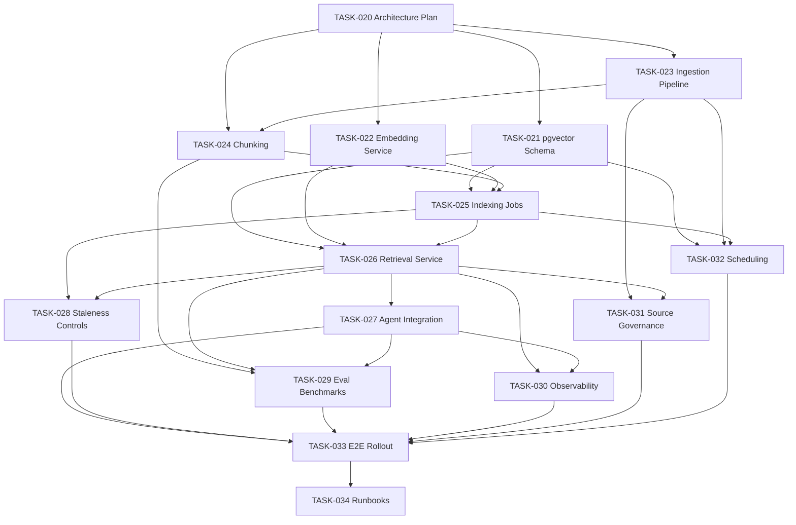

# ADR: Knowledge Retrieval and Embedding Pipeline

**Status:** Accepted  
**Date:** 2026-08-08  
**Authors:** Claus Albuquerque  
**Related docs:** [agent-retrieval-design.document.md](../../docs/agent-retrieval-design.document.md), [agent-persistance-tools.document.md](../../docs/agent-persistance-tools.document.md)

---

## Context

The FinOps and SRE agents produce cloud-agnostic analytical conclusions (e.g., "resource X is overprovisioned by 50%"). To make recommendations actionable, the agents need provider-specific context — machine type names, CLI commands, pricing, and operational constraints — retrieved at recommendation rendering time. This document specifies the implementation plan for the retrieval pipeline.

## Scope: Recommendation Rendering Only

Retrieval is **not** used for core analytical reasoning. The boundary is explicit:

```
┌─────────────────────────────────────────────────────────┐
│  Core Reasoning (NO retrieval)                          │
│  - Cost anomaly detection                               │
│  - Utilization analysis                                 │
│  - Forecast computation                                 │
│  - Optimization history checks                          │
│  - Inter-agent delegation                               │
│  All via structured SQL tool calls against FOCUS schema │
├─────────────────────────────────────────────────────────┤
│  Recommendation Rendering (WITH retrieval)              │
│  - SKU/machine type selection                           │
│  - CLI command resolution                               │
│  - Pricing details                                      │
│  - Operational constraints                              │
│  Via semantic retrieval from provider knowledge base    │
└─────────────────────────────────────────────────────────┘
```

The agent must be able to produce a valid (if generic) recommendation even when retrieval is unavailable. Retrieval enriches; it never gates.

## Tool Contracts

### 1. `retrieve_provider_context` — Runtime Retrieval

```python
from dataclasses import dataclass
from datetime import datetime


@dataclass
class RetrieveProviderContextInput:
    provider: str               # 'GCP' | 'Azure' | 'AWS'
    resource_type: str          # e.g., 'compute/instance', 'sql/database'
    query: str                  # natural-language retrieval query
    top_k: int = 5
    category: str | None = None # optional: 'machine_types', 'pricing', 'cli', 'constraints'
    max_age_days: int = 30      # freshness threshold


@dataclass
class RetrievedChunk:
    content: str                # chunk text
    score: float                # cosine similarity (0-1)
    source_url: str
    last_verified: datetime
    category: str
    provider: str
    resource_type: str
    chunk_id: str               # for audit trail


@dataclass
class RetrievalMetadata:
    total_candidates: int       # chunks that passed metadata filter
    search_latency_ms: float
    freshest_verified: datetime


@dataclass
class RetrieveProviderContextOutput:
    chunks: list[RetrievedChunk]
    metadata: RetrievalMetadata
```

**Invocation point:** After the agent has determined recommendation type and target parameters. Called as an Action step in the ReAct loop.

**Fallback behavior:** If retrieval returns 0 results or all scores are below 0.5, the agent produces a cloud-agnostic recommendation with a note: "Provider-specific details unavailable. Verify target configuration manually."

### 2. `ingest_provider_docs` — Ingestion Pipeline

```python
@dataclass
class IngestProviderDocsInput:
    source_id: str              # registered source identifier
    force_full: bool = False    # skip incremental diff, re-ingest everything


@dataclass
class IngestError:
    source_url: str
    error: str
    stage: str                  # 'fetch', 'parse', 'chunk', 'persist'


@dataclass
class IngestProviderDocsOutput:
    run_id: str
    documents_fetched: int
    documents_changed: int
    chunks_created: int
    chunks_updated: int
    chunks_deprecated: int
    errors: list[IngestError]
```

**Invocation:** Scheduled weekly (cron). Manual trigger available for ad-hoc updates.

### 3. `index_chunks` — Embedding and Indexing

```python
from typing import Literal


@dataclass
class IndexChunksInput:
    mode: Literal['full', 'incremental']
    provider: str | None = None  # scope to single provider (optional)


@dataclass
class IndexError:
    chunk_id: str
    error: str


@dataclass
class IndexChunksOutput:
    run_id: str
    chunks_embedded: int
    chunks_skipped: int          # already indexed, unchanged
    chunks_deprecated: int       # marked as stale
    embedding_latency_ms: float
    errors: list[IndexError]
```

**Invocation:** Triggered after successful ingestion run. Also callable independently.

## Data Flow

```
                    INGESTION (weekly)
                    ─────────────────
Official GCP Docs ──► Fetch & Normalize ──► kb_documents (versioned source)
(pricing, SKUs,        (HTML/MD → text)          │
 CLI, constraints)                               ▼
                                          Chunk & Enrich ──► kb_chunks (512-tok, metadata)
                                                                    │
                                                                    ▼
                    INDEXING (post-ingestion)     Embed ──► kb_embeddings (pgvector)
                    ────────────────────────      (nomic-embed-text-v1.5)
                                                                    │
                                                                    ▼
                    RETRIEVAL (runtime)           pgvector cosine search
                    ──────────────────           (metadata filter → vector similarity)
                                                                    │
                                                                    ▼
                    Agent ReAct loop ◄─── Retrieved chunks as Observation
                         │
                         ▼
                    Actionable recommendation with provider-specific details
```

## Database Schema (pgvector tables)

### `kb_documents` — Source Document Registry

| Column | Type | Description |
|--------|------|-------------|
| `id` | uuid PK | |
| `source_id` | varchar UNIQUE | Stable identifier (e.g., `gcp-compute-machine-types`) |
| `source_url` | varchar | Official documentation URL |
| `provider` | varchar | `'GCP'`, `'Azure'`, `'AWS'` |
| `category` | varchar | `'machine_types'`, `'pricing'`, `'cli'`, `'constraints'`, `'mappings'` |
| `content_hash` | varchar | SHA-256 of raw fetched content (for change detection) |
| `last_fetched` | timestamptz | When source was last fetched |
| `last_changed` | timestamptz | When content actually changed |
| `fetch_status` | varchar | `'success'`, `'error'`, `'not_found'` |
| `is_active` | boolean | Soft-disable without deletion |
| `created_at` | timestamptz | |
| `updated_at` | timestamptz | |

### `kb_chunks` — Chunked Content

| Column | Type | Description |
|--------|------|-------------|
| `id` | uuid PK | |
| `document_id` | uuid FK → kb_documents | Parent document |
| `chunk_index` | integer | Order within document |
| `content` | text | Chunk text content |
| `token_count` | integer | Actual token count |
| `content_hash` | varchar | SHA-256 of chunk content (dedup + change detection) |
| `provider` | varchar | Denormalized from document for fast filtering |
| `resource_type` | varchar | e.g., `'compute/instance'` |
| `category` | varchar | Denormalized from document |
| `last_verified` | timestamptz | When content was confirmed current |
| `is_deprecated` | boolean | Soft-delete; excluded from retrieval |
| `metadata` | jsonb | Additional structured tags |
| `created_at` | timestamptz | |
| `updated_at` | timestamptz | |

**Indexes:**
- `(provider, resource_type, is_deprecated)` — metadata filter
- `(document_id, chunk_index)` — ordering
- `(content_hash)` — dedup

### `kb_embeddings` — Vector Index

| Column | Type | Description |
|--------|------|-------------|
| `id` | uuid PK | |
| `chunk_id` | uuid FK → kb_chunks UNIQUE | One embedding per chunk |
| `embedding` | vector(768) | nomic-embed-text-v1.5 output |
| `model_version` | varchar | Embedding model identifier |
| `created_at` | timestamptz | |

**Indexes:**
- `ivfflat (embedding vector_cosine_ops)` — pgvector ANN index (lists=100 initially, tuned with data)

### `kb_ingestion_runs` — Audit Log

| Column | Type | Description |
|--------|------|-------------|
| `id` | uuid PK | |
| `run_type` | varchar | `'ingest'`, `'index'`, `'verify'` |
| `source_id` | varchar nullable | Scoped to a source, or null for all |
| `status` | varchar | `'running'`, `'completed'`, `'failed'` |
| `documents_processed` | integer | |
| `chunks_created` | integer | |
| `chunks_updated` | integer | |
| `chunks_deprecated` | integer | |
| `errors` | jsonb | Error details |
| `started_at` | timestamptz | |
| `completed_at` | timestamptz nullable | |

## Embedding Model

| Property | Value |
|----------|-------|
| Model | `nomic-embed-text-v1.5` |
| License | Apache 2.0 |
| Dimensions | 768 |
| Max context | 8,192 tokens |
| Deployment | Local container (CPU inference, ~50ms/query) |
| Matryoshka | Can truncate to 256/512 dims if performance requires |

Single model for both indexing and query embedding. Container image pinned by digest for reproducibility.

## Retrieval Algorithm

```
retrieve_provider_context(provider, resource_type, query, top_k=5, category?, max_age_days=30):
  1. Embed `query` → query_vector (768-dim)
  2. Filter kb_chunks WHERE:
       provider = $provider
       AND resource_type = $resource_type
       AND is_deprecated = false
       AND last_verified > now() - interval '$max_age_days days'
       AND (category = $category OR $category IS NULL)
  3. JOIN kb_embeddings ON chunk_id
  4. ORDER BY embedding <=> query_vector  -- cosine distance
  5. Apply freshness penalty:
       final_score = cosine_similarity * freshness_factor
       freshness_factor = GREATEST(0.7, 1.0 - (days_since_verified - 14) * 0.01)
  6. LIMIT $top_k
  7. Return chunks with content, score, metadata
```

## Phased Rollout Plan

### Phase 1: Foundation (TASK-020 → TASK-022)
- Architecture approved ✓ (this document)
- pgvector schema + migrations
- Embedding service container running locally

### Phase 2: Ingestion Pipeline (TASK-023 → TASK-025)
- GCP source registry with 5 initial sources (machine types, pricing, CLI, constraints, CUD docs)
- Chunker with section-boundary splitting
- Full indexing job populates vector store

### Phase 3: Retrieval Service (TASK-026 → TASK-027)
- `retrieve_provider_context` tool endpoint live
- Wired into agent recommendation rendering step
- Fallback behavior verified

### Phase 4: Quality & Safety (TASK-028 → TASK-031)
- Staleness controls active
- Evaluation benchmarks passing
- Observability dashboards live
- Source governance enforced

### Phase 5: Production (TASK-032 → TASK-034)
- Automated weekly ingestion scheduled
- E2E validation passing
- Runbooks documented
- Rollout to production with monitoring

## Dependency Graph



## Decisions

| Decision | Choice | Rationale |
|----------|--------|-----------|
| Vector store | pgvector (PostgreSQL extension) | Same infra as operational data; no new dependency |
| Embedding model | nomic-embed-text-v1.5 | OSS, Apache 2.0, 768-dim, 8K context, CPU-runnable |
| Chunk size | 512 tokens max | Matches spec table sizes; good embedding model sweet spot |
| Overlap | 50 tokens | Context continuity across chunk boundaries |
| top_k | 5 (default) | Sufficient for SKU + CLI + pricing in one retrieval call |
| Freshness threshold | 30 days hard, 14-day decay start | Balances freshness vs. coverage |
| Ingestion cadence | Weekly | Cloud pricing changes are infrequent; 6-day max staleness acceptable |
| Fallback | Generic recommendation + manual note | Retrieval enriches but never gates |
| Source policy | Official docs only | Auditability and accuracy over breadth |

## Risks and Mitigations

| Risk | Impact | Mitigation |
|------|--------|------------|
| Stale pricing in KB | Invalid savings estimates | Freshness decay + post-execution drift detection |
| Embedding model quality insufficient | Poor retrieval precision | Evaluation benchmarks gate rollout; model is swappable |
| pgvector performance at scale | Slow retrieval | IVFFlat index; corpus is small (<10K chunks); upgrade to HNSW if needed |
| Source docs change structure | Chunker produces bad splits | Section-boundary heuristics + chunk quality checks + weekly validation |
| Single provider initially | Over-fitted to GCP patterns | Schema and metadata are provider-agnostic from day 1 |
