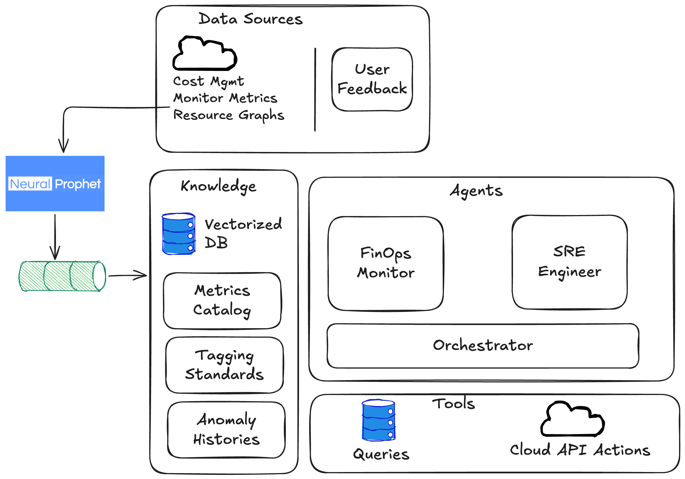

# Capstone Project: FinOps Forecasting Agent

Author: Claus Albuquerque

Course: Agentic AI Program: Building Autonomous Systems for Real-World Applications

Checkpoint: 1.2 - August 2, 2026.

> Implementation roadmap: see [ai-implementation-plan.md](ai-implementation-plan.md) for the phased build plan covering data, agents, orchestration, HITL, predictions, testing, and dashboard.

## Agent Type: Forecaster

---

## The Agent, the Problem, and the Intended User

The FinOps Forecasting Agent is an intelligent system that continuously analyzes cloud cost and resource usage data to predict future spending, detect anomalies against forecasted baselines, and deliver actionable cost-optimization recommendations. The core problem it addresses is the inability of engineering and finance teams to anticipate cloud cost outcomes before they materialize on invoices. Cloud environments generate thousands of cost signals daily—across services, teams, regions, and environments—making it impractical for humans to manually track spending trajectories, identify deviations from expected patterns, or proactively surface savings opportunities before budgets are breached.

The intended users are FinOps engineers who need full-spectrum cost visibility, team leads who require budget-scoped forecasts for their services, and finance stakeholders who depend on reliable spend projections for planning. Each persona interacts with the agent differently: FinOps engineers ask granular questions and configure detection sensitivity; team leads consume proactive alerts and recommendations for their scope; finance stakeholders rely on forecasted budget-vs-actual projections.

## Why a Standalone LLM or Simple Prompting Is Not Sufficient

A standalone LLM cannot forecast cloud costs because it lacks access to live billing data, resource utilization metrics, and historical baselines required to produce grounded predictions. Simple prompting would yield hallucinated cost figures with no connection to actual Cloud consumption. The agent must invoke structured tools—querying cost aggregates by service and time range, retrieving anomaly classifications, computing reservation coverage gaps—before it can reason about the data. Additionally, forecasting requires trained statistical and ML models (seasonal decomposition, Isolation Forest, Prophet) that produce numerical predictions the LLM alone is incapable of generating. The agent also enforces role-based access control, ensuring that a team lead cannot access another team's cost data through natural-language queries—a guardrail that pure prompting cannot implement. Finally, the system must continuously retrain its models using labeled feedback, which demands persistent state and scheduled computation beyond what a stateless prompt-response pattern supports.

## The Environment

**Data sources:** Cloud Cost Management APIs (amortized and actual cost views), Cloud Monitor Metrics API (compute, storage, and network utilization per resource), Cloud Resource Graph (resource inventory snapshots), and a user feedback pipeline capturing alert responses and dashboard interactions.

**Documents and knowledge:** A metrics catalog defining formulas, thresholds, and ownership for every KPI; tagging standards (v1 and v2) that map resources to teams and cost centers; and anomaly summary histories stored as text for semantic retrieval.

**Tools the agent invokes:**

- *Read-only (autonomous):* `query_cost_by_service(service, date_range)`, `get_anomalies(severity, date_range)`, `get_ri_coverage()`, `forecast_spend(dimension, horizon)`, `get_idle_resources(threshold_days)`. These tools query PostgreSQL and the trained model registry to return structured, verified data.
- *Write actions (human-in-the-loop):* `downgrade_resource_sku(resource_id, target_sku)`, `deallocate_resource(resource_id)`, `delete_resource(resource_id)`. These tools require explicit human approval before execution—the agent proposes the action with estimated savings and impact analysis, the responsible owner reviews and confirms via an approval workflow (dashboard button or Slack prompt), and only then does the agent execute the change. Rejected proposals are logged as feedback to refine future recommendations.

**Users:** FinOps engineers (full access, configuration authority), team leads (team-scoped data), and finance stakeholders (organization-wide aggregates, read-only).

## The Actions the Agent Takes

1. **Forecast:** Runs daily time-series predictions (Prophet-based) for each cost dimension, projecting next-day and end-of-month expected spend.
2. **Detect:** Compares actual costs against forecasted baselines using Z-score thresholds and Isolation Forest outputs; flags deviations as anomalies classified by type (spike, drift, drop, new-resource) and severity.
3. **Attribute and Route:** Assigns each anomaly to its root-cause dimension (resource, team, service, region) and routes alerts to the responsible owner via Slack, email, or ServiceNow.
4. **Recommend:** Generates ranked optimization suggestions—idle resource decommissioning, reservation purchases, rightsizing—with estimated dollar impact.
5. **Act (human-in-the-loop):** For approved recommendations, the agent executes write actions—downgrading a resource SKU, deallocating idle compute, or deleting orphaned resources. Each action follows a propose → review → confirm → execute workflow: the agent presents the change with estimated savings and blast-radius analysis, the responsible owner approves or rejects via a dashboard button or Slack prompt, and only upon explicit confirmation does the agent invoke the write tool. Rejections are captured as feedback signals.
6. **Converse:** Answers natural-language queries by retrieving relevant data through tool calls, augmenting the LLM context, and returning grounded, structured responses with supporting charts and action buttons.

## How Feedback Guides Behavior Across Steps

Feedback operates as a closed loop across the entire pipeline. When a user labels an anomaly alert as a false positive, that label flows into the training dataset, causing the weekly model retraining to adjust thresholds for the affected dimension—reducing future noise. When a user dismisses a proactive recommendation card, the deduplication engine suppresses that recommendation type for the same resource, and the recommendation ranker down-weights similar suggestions. Conversational responses collect thumbs-up/down ratings that feed into a weekly Agent Quality Report measuring groundedness and relevance; low-scoring query patterns trigger prompt refinements or tool-definition updates. Finally, dashboard interaction telemetry (filters used, drill-downs followed after an agent suggestion) provides implicit feedback on which recommendations actually drove user action, further refining the ranking algorithm. This multi-signal feedback loop enables the agent to improve forecast precision, reduce alert fatigue, and surface increasingly relevant recommendations over time.

## Reasoning Loop: ReAct Across Two Specialist Agents

The system is composed of two collaborating agents—the **FinOps Agent** and the **SRE Agent**—each implementing a ReAct (Reason + Act) loop tailored to its domain. Both agents follow the same structural pattern: **Thought → Action → Observation → Thought → ...** until the agent reaches a grounded conclusion or determines that human input is required. The critical design choice is that neither agent operates in isolation; the FinOps Agent depends on the SRE Agent's infrastructure expertise to validate whether a cost optimization is operationally safe, and the SRE Agent depends on the FinOps Agent's cost context to prioritize which infrastructure concerns have meaningful financial impact.

### FinOps Agent: ReAct Over FOCUS-Normalized Cost Data

The FinOps Agent's reasoning loop is anchored in the FinOps Open Cost and Usage Specification (FOCUS). Every cost record stored in PostgreSQL follows the FOCUS schema—fields like `effectiveCost`, `chargeType`, `pricingModel`, `serviceCategory`, and `meterCategory` are normalized to FOCUS column definitions. This standardization is what makes the ReAct loop tractable: the agent reasons in a universal cost vocabulary rather than cloud-provider-specific billing jargon.

A concrete ReAct trace for an anomaly investigation:

1. **Thought:** "The daily cost digest shows a 34% week-over-week increase in the `Compute` service category. I need to determine whether this is driven by new resources, SKU changes, or increased usage of existing resources."
2. **Action:** `query_cost_by_service(service_category='Compute', date_range='last_14d', group_by='resource_id')` — queries the `consumption_records` table, filtering on FOCUS-aligned `service_category` and grouping by `resource_id`.
3. **Observation:** Three virtual machines in the `prod-analytics` resource group account for 78% of the increase. Their `effective_cost` doubled starting 8 days ago.
4. **Thought:** "The cost increase is concentrated on specific resources. I need to understand whether their utilization justifies the spend or whether they were inadvertently scaled up. This requires the SRE Agent's infrastructure perspective."
5. **Action:** `delegate_to_sre(resource_ids=[...], question='Are these resources appropriately sized for their current workload? What do utilization trends show over the last 14 days?')`
6. **Observation:** The SRE Agent responds with utilization summaries showing average CPU at 12% and memory at 18% — well below the underuse thresholds — and notes that the SKU was changed from `Standard_D4s_v3` to `Standard_E16s_v3` 8 days ago via an infrastructure pipeline.
7. **Thought:** "The SKU upgrade was unnecessary — utilization is far below even the previous tier's capacity. I should recommend a revert and estimate the savings."
8. **Action:** `forecast_spend(resource_ids=[...], horizon='30d', scenario='revert_to_D4s_v3')` followed by `propose_recommendation(type='rightsize', target_sku='Standard_D4s_v3', estimated_monthly_savings=...)`.
9. **Observation:** Recommendation created, routed to the `prod-analytics` team lead for approval.

The FOCUS alignment makes step 2 possible without ad-hoc SQL — the agent constructs queries using standardized dimension names that map directly to entity columns (`serviceCategory`, `chargeType`, `pricingModel`). This is what enables the agent to reason across billing periods, charge types (usage vs. purchase vs. tax), and pricing models (on-demand vs. reserved vs. spot) using a consistent vocabulary.

### SRE Agent: ReAct Over Infrastructure Topology and Utilization

The SRE Agent's reasoning loop focuses on answering a different question: **"Is this piece of infrastructure right-sized and appropriately configured for its actual workload?"** Rather than starting from cost signals, the SRE Agent starts from infrastructure state — resource topology, provisioned capacity, utilization metrics, and operational dependencies.

The SRE Agent's ReAct loop operates over three data layers:

- **Resource topology:** The `tracked_resources` table provides the inventory — what exists, where, what SKU, what provisioned capacity (`provisionedCapacity` JSONB field storing vCPUs, memory, DTUs, storage).
- **Utilization metrics:** The `utilization_summaries` table provides daily roll-ups of average, max, min, and P95 utilization per resource per metric, with `isUnderused` flags computed against configurable thresholds.
- **Metric definitions:** The `metric_definitions` table maps Azure Monitor metrics to resource types and marks which metrics are relevant for utilization analysis (`isUtilizationMetric`).

A concrete ReAct trace for a proactive infrastructure review:

1. **Thought:** "I need to assess the `prod-analytics` resource group for infrastructure health. I'll start by understanding what resources exist and their current utilization posture."
2. **Action:** `get_tracked_resources(resource_group='prod-analytics', is_active=true)` — queries `tracked_resources` joined with `resource_groups` and `subscriptions`.
3. **Observation:** 12 active resources — 3 VMs, 2 SQL databases, 4 storage accounts, 2 App Services, 1 Redis cache. SKUs and provisioned capacities returned.
4. **Thought:** "I need to check utilization trends for the compute resources (VMs and App Services) to identify any that are overprovisioned. Let me query the last 30 days of utilization summaries."
5. **Action:** `get_utilization_summaries(resource_ids=[...VMs and App Services...], date_range='last_30d', metrics=['Percentage CPU', 'Available Memory Bytes', 'CpuPercentage'])`.
6. **Observation:** Two of three VMs show `isUnderused=true` for 28 of the last 30 days. P95 CPU is under 15%. The App Services show healthy utilization at 45-60% average.
7. **Thought:** "The two underused VMs are candidates for rightsizing or consolidation. Before recommending action, I need to check if they have dependency relationships — are they part of an availability set, behind a load balancer, or connected to the SQL databases?"
8. **Action:** `query_resource_dependencies(resource_ids=[...two underused VMs...])` — queries Azure Resource Graph for network, storage, and compute relationships.
9. **Observation:** Both VMs are standalone batch-processing nodes, not behind a load balancer, no availability set. They connect to one of the SQL databases for read-only analytics queries.
10. **Thought:** "These are safe to rightsize independently. I'll pass my findings back to the FinOps Agent with the infrastructure context needed to calculate savings."

The key distinction from the FinOps Agent's loop is **what triggers reasoning**: the FinOps Agent reasons when cost signals deviate from expectations; the SRE Agent reasons when infrastructure state doesn't match workload demands. Together, they close the gap between "what does it cost?" and "does it need to cost that much?"

### Inter-Agent Collaboration Pattern

The two agents collaborate through a structured delegation protocol. When the FinOps Agent identifies a cost anomaly that requires infrastructure context, it delegates to the SRE Agent with a specific question and the relevant resource identifiers. The SRE Agent runs its own ReAct loop, produces a structured assessment (utilization data, dependency analysis, risk evaluation), and returns it to the FinOps Agent, which then synthesizes the cost and infrastructure perspectives into a recommendation. This delegation is itself an **Action** step in the outer ReAct loop — the FinOps Agent treats the SRE Agent's response as an **Observation** and continues reasoning.

The reverse flow also occurs: the SRE Agent may proactively identify underused infrastructure and delegate to the FinOps Agent to quantify the savings potential, ensuring that infrastructure observations translate into prioritized, dollar-denominated recommendations.

## Memory Architecture: Short-Term and Long-Term

The agent system requires both short-term and long-term memory, each serving a distinct purpose in the reasoning process.

### Short-Term Memory: Conversation and Reasoning Context

Short-term memory is the scratchpad of a single ReAct episode. It holds:

- **The reasoning trace:** The sequence of Thought → Action → Observation steps accumulated during the current investigation. This is essential because each new Thought must reference prior Observations — if the agent forgets that step 3 revealed three specific VMs driving a cost spike, step 4's reasoning collapses.
- **The user's conversational context:** When a FinOps engineer asks "Why did compute costs spike this week?" and then follows up with "What about the same team last month?", the agent must retain the prior turn's scope (the `prod-analytics` team) and the established context (the cost spike investigation) to resolve the pronoun "the same team."
- **Intermediate computation results:** Partial aggregations, comparison baselines, and candidate lists that are too transient to persist but are needed across multiple reasoning steps within one episode.

Short-term memory is implemented as the LLM's context window, managed by the orchestrator. The orchestrator appends each Action result as a structured Observation message and maintains the full trace until the episode concludes. For long investigations that risk exceeding context limits, the orchestrator summarizes earlier steps into a compressed narrative and replaces the original trace — preserving key facts (resource IDs, dollar amounts, dates) while discarding verbose raw data.

### Long-Term Memory: PostgreSQL as Persistent Knowledge

Long-term memory is implemented through the PostgreSQL database, which serves a dual role: it is both a **tool** the agent queries for data and the **persistent memory** where the agent stores what it has learned. This dual role is deliberate — it avoids the complexity of maintaining a separate memory store and ensures that all agent knowledge is queryable, auditable, and backed up with the same infrastructure as the operational data.

Long-term memory stores four categories of information:

1. **Optimization history:** Every recommendation the agent has made, its status (proposed, approved, rejected, executed), the estimated savings, the actual savings measured post-execution, and the user's feedback. This history is critical for two reasons: it prevents the agent from re-proposing rejected recommendations without new evidence, and it allows the agent to learn which recommendation types have high acceptance rates for specific teams.

2. **Anomaly context:** When the agent investigates a cost anomaly and determines a root cause, the resolution context (what caused it, what was done, whether it recurred) is persisted. Future anomalies on the same resource or dimension trigger retrieval of this history, allowing the agent to reason: "This resource had a similar spike 45 days ago caused by an autoscaling misconfiguration — was that fix durable?"

3. **Infrastructure baselines:** The SRE Agent maintains knowledge of what "normal" looks like for each resource — not just raw utilization numbers (those are in `utilization_summaries`), but interpreted baselines: "this VM runs batch jobs on weekday nights, so low daytime utilization is expected and does not indicate underuse." These interpreted baselines prevent the agent from generating false-positive rightsizing recommendations for resources with legitimate usage patterns that appear idle in aggregate metrics.

4. **User preferences and scope:** Per-user and per-team preferences — alert sensitivity thresholds, preferred communication channels, which recommendation types they've historically engaged with, which they've consistently dismissed. This enables the agent to personalize its behavior without requiring explicit configuration for every parameter.

### When and Why Memory Is Needed

Long-term memory is needed at specific points in the ReAct loop:

- **Before generating a recommendation:** The agent queries optimization history to check whether this recommendation (or a similar one for the same resource) was previously proposed and rejected. Without this memory, the agent would repeatedly propose the same unwanted changes, eroding user trust.
- **During anomaly investigation:** The agent queries anomaly context to determine whether the current anomaly matches a known pattern. Without this memory, every anomaly investigation starts from scratch, even for recurring issues with documented root causes.
- **When interpreting utilization data:** The SRE Agent queries infrastructure baselines to contextualize raw metrics. Without this memory, a batch-processing VM that runs at 5% CPU during the day would be flagged as underused every single day, generating daily false-positive alerts.

## External Tool Usage: Grounding Agent Reasoning in Real Data

The agent system uses external tools to overcome three fundamental limitations of LLM-only approaches: **data retrieval**, **numerical computation**, and **real-time state access**.

### Cloud Provider APIs as Tool Calls

The agents invoke cloud provider APIs through structured tool interfaces. These API calls are the primary mechanism for acquiring fresh data that does not yet exist in the database:

- **Azure Cost Management API** (`query_cost_by_service`, `get_ri_coverage`): Retrieves amortized and actual cost views, reservation utilization, and billing data. The API returns FOCUS-normalized cost records that the agent can reason over. This tool addresses the limitation that the LLM has no access to billing data — without it, any cost figure the agent produces would be a hallucination.

- **Azure Monitor Metrics API** (`get_resource_metrics`): Retrieves time-series utilization data (CPU, memory, disk, network) for tracked resources. The SRE Agent uses this to compute utilization summaries and detect underuse. This tool addresses the limitation that the LLM cannot observe real-time infrastructure state.

- **Azure Resource Graph** (`query_resource_topology`): Provides resource inventory snapshots, dependency relationships, and tag-based groupings. The SRE Agent uses this to understand what resources exist, how they relate to each other, and how they map to teams via tagging standards. This tool addresses the limitation that the LLM has no awareness of infrastructure topology.

### Database as Both Tool and Memory

The PostgreSQL database is used as a tool for two distinct purposes:

1. **Data retrieval tool:** The agent queries the database to retrieve historical cost records (`consumption_records`), utilization summaries (`utilization_summaries`), resource metadata (`tracked_resources`), and metric definitions (`metric_definitions`). These queries return structured data that the agent incorporates as Observations in its ReAct loop. The database entities — with FOCUS-aligned fields on `ConsumptionRecordEntity` and JSONB `provisionedCapacity` on `TrackedResourceEntity` — provide the structured schema that makes these queries precise and repeatable.

2. **Memory persistence tool:** The agent writes to the database to store optimization history, anomaly resolutions, infrastructure baselines, and user feedback. These writes are themselves Actions in the ReAct loop — the agent decides "I should remember that this anomaly was caused by an autoscaling event" and invokes a `store_anomaly_resolution(...)` tool to persist that knowledge.

### A Concrete Example: Why Tool Usage Is Necessary

Consider the task: *"What is the projected end-of-month spend for the data-platform team, and are there any optimization opportunities?"*

Without tools, the LLM would generate a plausible-sounding but entirely fabricated dollar figure. With the tool-augmented ReAct loop:

1. **Action:** `query_cost_by_service(tags={'team': 'data-platform'}, date_range='current_month')` → retrieves actual month-to-date spend from `consumption_records`.
2. **Action:** `forecast_spend(dimension='team:data-platform', horizon='end_of_month')` → invokes the Prophet-based forecasting model, which performs time-series computation the LLM is incapable of executing.
3. **Action:** `get_utilization_summaries(team='data-platform', is_underused=true, date_range='last_30d')` → retrieves flagged underused resources from the database.
4. **Action:** `get_optimization_history(team='data-platform', status='rejected', date_range='last_90d')` → retrieves previously rejected recommendations to avoid re-proposing them.

Each tool call addresses a specific limitation: step 1 provides grounding in real data (retrieval), step 2 performs statistical computation (computation), step 3 provides real-time infrastructure state (state access), and step 4 provides historical memory (persistence). No single prompt, no matter how sophisticated, can replicate any of these capabilities.

## How This Design Improves Over a Prompt-Only Approach

### The Failure Mode: Groundless Recommendations That Erode Trust

The specific failure mode this design resolves is the **groundless recommendation loop** — a pattern where a prompt-only system generates optimization suggestions that are either factually wrong (hallucinated cost figures), operationally unsafe (recommending decommission of a resource with active dependencies), or socially counterproductive (re-proposing a recommendation the team has already considered and rejected).

In a prompt-only system, a user asks "How can I reduce compute costs?" and receives a generic response: "Consider rightsizing underutilized VMs, purchasing reserved instances, or migrating to spot instances." This response is correct in the abstract but useless in practice — it doesn't tell the user *which* VMs are underutilized, *how much* they'd save by rightsizing, whether the VMs have dependencies that make rightsizing risky, or whether the team already evaluated and rejected RI purchases last quarter.

The design resolves each component of this failure:

- **Hallucinated cost figures → grounded through tool calls.** The agent never generates a dollar amount from its parametric knowledge. Every figure originates from a database query or a forecasting model invocation — both of which operate on verified FOCUS-normalized billing data.

- **Operationally unsafe recommendations → validated through SRE Agent collaboration.** Before the FinOps Agent proposes a rightsizing action, the SRE Agent assesses infrastructure dependencies, current utilization patterns, and workload characteristics. A recommendation to downgrade a VM is only surfaced after the SRE Agent confirms the resource is safe to modify.

- **Repeated rejected recommendations → prevented through long-term memory.** The agent queries its optimization history before generating any recommendation. If the `data-platform` team rejected an RI purchase recommendation 60 days ago, the agent will not re-propose it unless new data (e.g., a sustained usage increase that changes the break-even calculation) provides fresh justification.

- **Generic, unactionable advice → replaced by specific, scoped actions.** Instead of "consider rightsizing," the agent produces: "VM `analytics-worker-02` in `prod-analytics` has averaged 12% CPU and 18% memory over the last 30 days. Downgrading from `Standard_E16s_v3` to `Standard_D4s_v3` would save approximately $847/month. The SRE assessment confirms no load-balancer dependencies and no availability-set membership. [Approve] [Dismiss]."

### Design Reasoning Over Implementation Details

This document intentionally describes **what** the agents reason about and **why** each capability is needed, rather than prescribing specific frameworks, libraries, or deployment architectures. The ReAct loop structure, the memory categories, and the tool interfaces will be refined as the agents are built and tested. The design choices that are load-bearing — FOCUS normalization as the cost reasoning vocabulary, PostgreSQL as the unified tool-and-memory store, and the FinOps/SRE agent collaboration protocol — are grounded in the data structures already implemented in the codebase and will guide the implementation decisions that follow.
